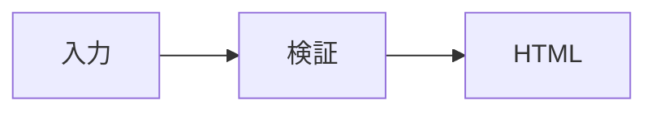

# rpt HTMLレポートCLI 設計仕様

## 概要

`rpt` は、生成AIが作成した制限付きMDXを、人間が読みやすい自己完結型HTMLへ変換するCLIです。Astroで静的HTMLを生成し、WebcoreUIでレポート内の重要情報を見分けやすくします。

初期版はmacOSとBunを対象にします。Mermaidを含まない生成HTMLはネット接続なしで閲覧でき、PC、スマートフォン、印刷で読みやすい構成にします。Mermaidを含む場合だけ、固定CDNと固定のクライアントJavaScriptを使う例外があります。詳細は[リッチコンテンツ拡張設計](2026-08-09-rpt-rich-content-design.md)を正本とします。

## 目的

- 生成AIが安定して出力できる小さなMDX契約を提供します。
- 未信頼のMDXをJavaScriptとして実行しないように構文を制限します。
- 1コマンドで共有可能な単一HTMLを生成します。
- 長いレポートでも要点と本文を追いやすい画面構成にします。
- chezmoiでCLI本体と固定済み依存関係を再現可能に配布します。

## 初期版に含めないもの

- 任意のAstroコンポーネント、JavaScript式、MDX importの実行
- Astro開発サーバーやブラウザの自動起動
- HTMLとアセットを分けた複数ファイル出力
- 外部URLからの画像取得
- Mermaid以外の図表レンダラー、Mermaidの任意設定、ビルド時SVG生成、オフライン図表示
- PDF出力
- LinuxとWindowsでの動作保証
- 実CLIで検証できる挙動を内部モジュールだけで確認するテスト

## CLI契約

基本コマンドは次の2形式です。

```sh
rpt build report.mdx -o report.html
rpt build - -o report.html
```

利用可能なオプションは次のとおりです。

- `-o, --output <path>`: 必須です。生成するHTMLの保存先を指定します。
- `--force`: 既存の出力ファイルを置き換えます。
- `--debug`: 内部エラーのスタックトレースを表示します。
- `-h, --help`: 使用方法を表示します。
- `-v, --version`: バージョンを表示します。

引数なしで実行した場合も成功として`--help`と同じ詳細な案内をstdoutへ表示します。案内には、基本コマンド、AIがMDXを生成するためのfrontmatter契約、safe HTMLとinline styleの制約、全許可コンポーネントの最小例、MermaidのCDN例外、入力・画像・図の上限、単一HTMLの出力規則を含めます。完全なCSS propertyとIcon nameの列挙は案内せず、固定catalogと代表例を示します。

入力に `-` を指定した場合はstdinから読み取ります。それ以外は指定したUTF-8のMDXファイルを読み取ります。入力MDXの上限は5MiBです。ファイル入力は実際に開いたdescriptorがregular fileであることを確認し、最大5MiB+1byteだけを読みます。FIFO、device、directoryは読み始める前にI/Oエラーとして拒否します。

成功時は生成したHTMLの絶対パスをstdoutへ1行で表示し、終了コード`0`を返します。診断情報はstderrへ出します。

## frontmatter

frontmatterでは次のキーだけを許可します。未知のキーは入力ミスとして拒否します。

- `title`: 必須の空でない文字列です。
- `summary`: 任意の文字列です。
- `author`: 任意の文字列です。
- `createdAt`: 任意の`YYYY-MM-DD`形式の文字列です。
- `status`: 任意の`draft`、`final`、`archived`のいずれかです。
- `tags`: 任意の空でない文字列の配列です。

## 制限付きMDX

通常のMarkdownに加え、GFMのテーブル、取り消し線、タスクリスト、脚注、コードブロックを許可します。

次のレポート専用タグと、allowlistにある小文字safe HTMLだけを許可します。タグ名と属性名は大文字と小文字を区別し、属性値は引用符で囲んだ静的文字列に限ります。レポート専用タグには`class`、`style`、`id`、イベント属性を渡せません。

### Callout

重要な補足や警告を表示します。

```mdx
<Callout tone="warning" title="確認が必要">
移行前にバックアップを取得してください。
</Callout>
```

- `tone`: 必須です。`info`、`success`、`warning`、`danger`のいずれかです。
- `title`: 任意の文字列です。
- 子要素には許可済みMarkdownを記述できます。

### Metric

1つの指標を短く表示します。

```mdx
<Metric label="削減工数" value="24%" />
```

- `label`: 必須の文字列です。
- `value`: 必須の文字列です。
- 子要素は持ちません。

### Evidence

結論の根拠と参照先を表示します。

```mdx
<Evidence title="試行結果" source="https://example.com/report">
2週間の試行中に重大な障害は発生しませんでした。
</Evidence>
```

- `title`: 必須の文字列です。
- `source`: 必須のHTTPS URLです。
- 子要素には許可済みMarkdownを記述できます。

### Section

レポートの大きな区切りを表示し、目次へ追加します。`Section`は本文の最上位にだけ置けます。入れ子にはできません。

```mdx
<Section title="比較結果">
本文を記述します。
</Section>
```

- `title`: 必須の文字列です。
- 子要素には許可済みMarkdownと、`Section`以外のレポート専用タグを記述できます。

## リッチコンテンツ

### safe HTMLとinline style

小文字のsafe HTMLでは構造（`article`、`section`、`aside`、`header`、`footer`、`div`、`span`）、本文、リスト、表、補助要素（`details`、`summary`、`figure`、`time`、`a`など）だけを許可します。静的な`id`、`role`、`aria-*`、`title`、`lang`、`dir`、`style`と、要素固有のallowlist属性だけを使えます。リンクとciteのURLは相対URL、fragment、HTTPS、`mailto:`に限ります。

`style`は色、文字、box、Flex/Grid、表、リストの固定allowlistだけを使えます。重複property、`!important`、カスタムproperty、危険なURL/image関数、position、animation、transformなどは拒否します。`var()`はfallbackなしの`--w-`で始まるWebcoreUI変数だけを許可します。`class`、`data-*`、イベント属性、spread属性、式属性は許可しません。

### 専用コンポーネント

既存の`Callout`、`Metric`、`Evidence`、`Section`に加えて、`Badge`、`Status`、`Icon`、`Timeline`、`TimelineItem`、`Tabs`、`Tab`を許可します。全属性は静的文字列です。

```mdx
<Badge tone="success">承認済み</Badge>
<Status tone="warning">確認待ち</Status>
<Icon name="circle-check" label="完了" size="20" />

<Timeline theme="icons">
  <TimelineItem title="調査" icon="search">要件を確認します。</TimelineItem>
  <TimelineItem title="実装" icon="check">機能を追加します。</TimelineItem>
</Timeline>

<Tabs>
  <Tab label="概要" active="true">概要の本文</Tab>
  <Tab label="詳細">詳細の本文</Tab>
</Tabs>
```

`Badge`と`Status`の`tone`は`neutral`、`info`、`success`、`warning`、`danger`です。`Icon.name`と`TimelineItem.icon`は固定WebcoreUI icon catalogから選びます（例: `alert`、`circle-check`、`github`、`info`、`warning`）。`Timeline`は2件以上の直接の`TimelineItem`だけを持ち、`theme="icons"`では各itemにiconが必須です。`Tabs`は2〜10件の直接の`Tab`だけを持ち、activeは最大1件です。入れ子のTimelineとTabsは拒否します。

### Mermaid

小文字の`mermaid` fenced code blockだけを図として扱います。1図は64KiB以下、1レポートは20図以下で、Mermaid frontmatterとinit directiveは拒否します。

````md

````

Mermaidを含むレポートだけは、固定した`mermaid@11.16.0` CDNとnonce付きの固定初期化scriptを使うクライアントJavaScript例外があります。JavaScriptが無効またはCDN取得に失敗した場合、元のsourceを表示します。Mermaidを含まないレポートは外部アセットとclient JavaScriptを持ちません。安全性、最終DOM、CSPの詳細は[リッチコンテンツ拡張設計](2026-08-09-rpt-rich-content-design.md)に従います。

## 禁止する構文

次の構文を検出した場合は、Astroへ渡す前に入力を拒否します。

- `import`と`export`
- JavaScript式
- 未登録のMDXタグ
- allowlist外のHTML、属性、親子構造、inline style
- スクリプト、`class`、イベント属性、危険なURLスキーム
- 動的な属性値とスプレッド属性
- `Section`の入れ子

リンクは相対URL、ページ内フラグメント、HTTPS URL、メールアドレスを許可します。`javascript:`などの実行可能なURLは拒否します。

## 画像

Markdown画像はbase64形式のdata URLまたは相対パスを許可します。data URLで許可するMIME typeは`image/png`、`image/jpeg`、`image/gif`、`image/webp`、`image/avif`だけです。decode後のmagic bytesが宣言MIMEと一致しない画像、SVG、未知のMIME type、不正なbase64はAstro build前に拒否します。HTTPとHTTPSの画像URL、絶対パスは拒否します。

相対パスの基準は、ファイル入力では入力MDXがあるディレクトリ、stdin入力ではコマンド実行時のカレントディレクトリです。基準ディレクトリの外へ移動するパスは拒否します。ローカル画像は実際に開いたdescriptorのidentityとregular fileであることを確認し、descriptor sizeと最大5MiB+1byteの実読込の両方で制限します。許可した画像はmagic bytesからMIME typeを判定してdata URLへ変換します。

画像は1件あたりdecode後5MiBまでです。1レポートのdecode後画像合計は20MiBまでとし、ローカル画像とdata URL画像の両方を合計します。

## 画面設計

レポートは読み物型のレイアウトにします。

- PCでは左側に固定目次を置き、右側の本文幅を最大760pxにします。
- スマートフォンでは1列に変更し、目次を折りたたみます。
- 冒頭にタイトル、要約、ステータス、作成者、作成日、タグを表示します。
- Markdown見出しと`Section`から目次とアンカーリンクを生成します。
- Markdown見出しと`Section`のIDを考慮して本文`main`のIDを割り当て、skip linkと同じIDを使います。
- 重要情報だけをWebcoreUIのAlert、Card、Badgeなどで強調します。
- コード、表、長いURLが画面幅を超えないようにします。
- OS標準フォントを使い、フォントファイルを参照しません。
- スキップリンク、セマンティックHTML、十分な色コントラストを使用します。
- 印刷時は目次を除き、A4で読みやすい余白と文字サイズへ変更します。
- Mermaidを含まないレポートはクライアントJavaScriptを出力しません。Mermaidを含む場合だけ、固定CDNとnonce付き固定初期化scriptを出力します。

## アーキテクチャ

### 配置

```text
dot_local/bin/executable_rpt
dot_local/lib/rpt/
├── package.json
├── bun.lock
├── astro.config.mjs
├── tsconfig.json
├── src/
│   ├── cli.ts
│   ├── args.ts
│   ├── input.ts
│   ├── validate.ts
│   ├── build.ts
│   ├── inline-assets.ts
│   ├── components/
│   ├── layouts/
│   └── template/
└── fixtures/
tests/rpt.e2e.test.ts
run_onchange_after_install-rpt-dependencies.sh.tmpl
```

`dot_local/bin/executable_rpt`は`~/.local/bin/rpt`へ配布します。エントリーポイントは`~/.local/lib/rpt/src/cli.ts`をBunで実行するだけにします。

`dot_local/lib/rpt`は独立したAstroパッケージです。Astro、MDX integration、WebcoreUI、Sass、構文検証用パッケージをここで管理します。`package.json`と`bun.lock`を追跡し、実行時のダウンロードを行いません。

### コンポーネント境界

- `args.ts`: CLI引数を解析し、使用方法を生成します。
- `input.ts`: ファイルまたはstdinを上限付きで読み、サイズと画像の基準ディレクトリを決めます。
- `validate.ts`: frontmatterとMDX ASTを検査し、許可した入力だけを返します。
- `build.ts`: 一時Astroプロジェクトを準備し、Astroビルドを子プロセスとして実行します。
- `inline-assets.ts`: 画像などをdata URLへ変換し、Mermaidの固定CDN例外以外の外部アセット参照が残っていないことを検査します。
- Astro layoutとcomponents: 画面構造とレポート専用タグのWebcoreUI表現を担当します。
- `cli.ts`: 各処理を順番に呼び、診断表示と終了コードを決めます。

### ビルド処理

1. CLI引数を検証します。
2. MDXを読み、frontmatterとASTを検証します。
3. `mkdtemp`で一意な作業ディレクトリを作ります。
4. 固定のAstroテンプレートと検証済みMDXを作業ディレクトリへ配置します。
5. インストール済みパッケージの`node_modules`を作業ディレクトリから参照できるようにします。
6. Astroの静的ビルドを子プロセスで実行します。
7. CSSをHTML内へ配置し、画像をdata URLへ変換します。
8. Mermaidを含まない場合は外部stylesheet、script、外部画像、外部font参照が残っていないことを検査します。Mermaidを含む場合は固定CDN scriptとnonce付き固定初期化scriptだけを例外として検査します。全IDが一意であり、内部fragment linkが一意な実在IDへ解決することも検査します。通常のHTTPSリンクはfragmentを含めて残せます。
9. 出力先と同じディレクトリに一時ファイルを書き、成功後に指定先へ置き換えます。
10. 成否にかかわらず作業ディレクトリを片付けます。

一意な作業ディレクトリを使うため、複数の`rpt`を同時実行しても入力や出力が混ざりません。インストール済みのテンプレートと入力MDXは変更しません。

## WebcoreUIとAstroの設定

Astro設定へ`@astrojs/mdx`と`webcoreui/integration`を追加します。WebcoreUIのAstroコンポーネントは`webcoreui/astro`から読み込みます。

生成CSSはAstroの`build.inlineStylesheets: "always"`でHTMLへ埋め込みます。WebcoreUIの既定フォント参照は使わず、システムフォントへ置き換えます。TabsはJavaScriptなしで表示し、Mermaidだけが固定CDNを使うクライアント処理の例外です。

実装時点ではWebcoreUI 1.5.0とAstro 5系を基準に互換性を確認し、採用した正確なバージョンを`package.json`と`bun.lock`へ固定します。

## エラー処理

すべての利用者向けエラーは`rpt:`で始め、stderrへ表示します。MDXの問題は可能な限り行と列、問題の内容、修正方法を含めます。`--debug`を指定しない限りスタックトレースは表示しません。

- 終了コード`2`: 引数とオプションの誤り
- 終了コード`3`: frontmatter、MDX構文、画像パスなど入力の誤り
- 終了コード`4`: Astroビルドと単一HTML化の失敗
- 終了コード`5`: 入出力ファイルの読み書き失敗

出力先が既に存在する場合は、`--force`がなければ終了コード`5`で拒否します。出力は同じディレクトリ内の一時ファイルへ書き、完成後に置き換えます。失敗時に新しい不完全なHTMLを残しません。

## chezmoiでの配布

`run_onchange_after_install-rpt-dependencies.sh.tmpl`は、`package.json`または`bun.lock`が変わった場合に`~/.local/lib/rpt`で`bun install --frozen-lockfile`を実行します。Astroはレポート生成時にも必要なため、ビルド関連パッケージを含めてインストールします。

`docs/`と`tests/`は既存の`.chezmoiignore`によりホームディレクトリへ配布しません。

## 自動テスト

初期版では実CLIのE2Eテストを中心にします。テストはBunから実際の`rpt`エントリーポイントを子プロセスとして起動し、一時ディレクトリ内の入出力を検査します。制限付きMDXから生成できない敵対的HTMLと、同時publishの競合だけはfocused boundary testで検査できます。

次の利用経路を検証します。

- ファイル入力から自己完結型HTMLを生成できます。
- stdin入力から自己完結型HTMLを生成できます。
- 出力にタイトル、メタデータ、目次、見出し、レポート専用タグが含まれます。
- MermaidなしではCSSとローカル画像が埋め込まれ、外部アセットとscriptが残りません。Mermaidありでは固定CDNと固定初期化scriptだけを許可します。
- 許可したbase64 raster data URLを維持し、不正なdata URLをAstro build前に拒否します。
- ファイル入力と画像の1件5MiB、画像合計20MiBを超過前に拒否します。
- main、見出し、`Section`、脚注を含む全IDが一意で、skip link、目次、脚注のfragmentが一意な実在IDへ解決します。
- import、JavaScript式、allowlist外HTML、未登録タグ、`class`とイベント属性、危険なURLを行と列付きで拒否します。
- `--force`なしでは既存ファイルを変更しません。
- `--force`付きでは既存ファイルを置き換えます。
- 失敗時に新しい不完全なHTMLを残しません。
- stdout、stderr、終了コードがCLI契約と一致します。
- 2つの生成処理を同時に実行しても内容が混ざりません。

HTML全体のスナップショットは使いません。利用者が確認できるHTML構造と安全性の条件を個別に検査します。

## 完了条件

- 合意したCLI契約でファイル入力とstdin入力を処理できます。
- 制限付きMDX以外はAstro実行前に拒否されます。
- WebcoreUIを使った読み物型レポートを生成できます。
- Mermaidなしの生成HTMLは外部アセットなしで表示でき、クライアントJavaScriptを必要としません。Mermaidありでは固定CDNと固定初期化scriptだけを例外として許可します。
- スマートフォン表示と印刷用CSSを含みます。
- 実CLI E2Eとfocused boundary testがすべて成功します。
- 型検査、Astroビルド、`git diff --check`、chezmoi配布差分の確認が成功します。

## 参考資料

- [WebcoreUI Astro導入手順](https://webcoreui.dev/docs/astro)
- [WebcoreUI AI連携ガイド](https://webcoreui.dev/docs/ai)
- [WebcoreUI changelog](https://webcoreui.dev/docs/changelog)
- [Astro MDX integration](https://docs.astro.build/en/guides/integrations-guide/mdx/)
- [Astro styling](https://docs.astro.build/en/guides/styling/)
