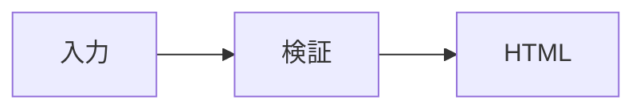

# rpt リッチコンテンツ拡張 設計仕様

## 概要

`rpt`の制限付きMDXへ、安全なセマンティックHTML、Mermaid図、Badge、Status、Icon、Timeline、Tabsを追加します。未信頼入力をAstro実行前にallowlist検証する既存方針を維持し、Mermaidを含むレポートだけは固定バージョンのCDNスクリプトを例外として許可します。

## 目的

- AIが表現力の高いレポートを、明示的で小さな入力契約から生成できるようにします。
- Markdownで表現しにくい意味構造とレイアウトを、安全な小文字HTMLで補えるようにします。
- 図、状態、時系列、切替可能な補足情報を専用コンポーネントで一貫して表示します。
- 危険なHTML、CSS、JavaScript、外部アセットをAstro実行前と最終DOMの両方で拒否します。
- Mermaidを含まないレポートの自己完結性とJavaScriptなしの出力を維持します。

## 対象外

- `.html`ファイルをCLI入力として受け取ること
- 任意のSVG、任意のアイコン、任意のWebcoreUIコンポーネント
- raw HTML内の画像、フォーム、メディア、見出し
- 利用者が指定するCSS class、style block、外部stylesheet
- JavaScriptによるTabs操作
- Mermaidのビルド時SVG生成とオフライン表示
- Mermaid以外のクライアントJavaScript

## 設計判断

既存のremark-mdx AST検証を拡張します。小文字のHTML要素は`mdxJsxFlowElement`または`mdxJsxTextElement`として検証し、大文字の専用コンポーネントは別のschemaで検証します。検証後のMDXだけをAstroへ渡すため、危険入力を生成後に削除する方式は採りません。

Badge、Icon、TimelineはWebcoreUI 1.5.0の静的Astroコンポーネントを利用します。StatusとJavaScriptなしのTabsは`rpt`専用コンポーネントとして実装します。Mermaidは公式ブラウザ版11.16.0を固定CDNから読み込み、閲覧時にコードブロックをSVGへ変換します。

## 処理フロー

1. 入力を最大5MiBで読み取ります。
2. remarkでMDX ASTを生成します。
3. frontmatter、Markdown、画像、safe HTML、inline style、専用コンポーネント、Mermaidコードブロックを検証します。
4. `Section`とTabsに必要な内部IDを割り当て、利用者が指定したIDと衝突しないようにします。
5. 検証済みMDXと`ValidatedReport`のmetadataを一時Astroプロジェクトへ渡します。
6. Astroが静的HTMLを生成します。Mermaidコードブロックは元コードを保持する描画対象へ変換します。
7. 全レポートへContent Security Policyを追加し、Mermaidが存在する場合だけ固定CDN scriptと固定初期化scriptを追加します。
8. CSSと画像をinline化し、最終DOMのID、fragment、URL、style、script、外部アセットを検査します。
9. 検査済みHTMLをatomic writeします。

## ファイル責務

- `src/validate.ts`: AST走査、metadata、Markdown、画像、outline、内部IDの統合を担当します。
- `src/safe-html.ts`: 小文字HTML要素、属性、ARIA、要素固有属性、親子構造を検証します。
- `src/safe-style.ts`: `style`属性をcss-treeで解析し、プロパティと値を検証します。
- `src/component-rules.ts`: 専用コンポーネントの属性、子要素、親子関係、件数制約を定義します。
- `src/mermaid.ts`: Mermaidコードブロックの検出、件数、サイズ、禁止設定を検証します。
- `template/src/components/`: Badge、Status、Icon、Timeline、TimelineItem、Tabs、Tabの表示を担当します。
- `template/src/rehype-mermaid.mjs`: 検証済みの`mermaid`コードブロックを描画対象へ変換します。
- `src/inline-assets.ts`: Mermaid例外を含む最終DOMとCSPを検査します。

`ValidatedReport`へ`hasMermaid: boolean`を追加します。この値は検証器がコードブロックから決定し、利用者は指定できません。

## safe HTML

### 許可要素

次の小文字要素だけを許可します。

- 構造: `article`、`section`、`aside`、`header`、`footer`、`div`、`span`
- 本文: `p`、`br`、`hr`、`blockquote`、`q`、`cite`、`abbr`、`pre`、`code`、`kbd`、`samp`、`var`、`mark`、`strong`、`em`、`b`、`i`、`u`、`s`、`small`、`sub`、`sup`
- リスト: `ul`、`ol`、`li`、`dl`、`dt`、`dd`
- 表: `table`、`caption`、`thead`、`tbody`、`tfoot`、`tr`、`th`、`td`、`colgroup`、`col`
- 補助: `details`、`summary`、`figure`、`figcaption`、`time`、`data`、`a`

`script`、`style`、`link`、`meta`、`base`、`iframe`、`object`、`embed`、`svg`、`math`、フォーム要素、メディア要素、`img`、`h1`から`h6`は拒否します。画像と見出しは既存のMarkdown記法を使います。

### 属性

全許可要素で次を許可します。

- `id`: 空でない一意な値。`rpt-`で始まる値は内部予約のため拒否します。
- `role`: 非対話用途の`article`、`complementary`、`contentinfo`、`definition`、`document`、`figure`、`group`、`list`、`listitem`、`none`、`note`、`presentation`、`region`、`status`、`table`、`row`、`rowgroup`、`columnheader`、`rowheader`、`cell`だけを許可します。
- `aria-*`: 静的文字列だけを許可します。`aria-labelledby`、`aria-describedby`、`aria-details`の参照先は最終DOMで一意に実在する必要があります。
- `title`、`lang`、`dir`: `dir`は`ltr`、`rtl`、`auto`だけを許可します。
- `style`: 後述のsafe styleだけを許可します。

要素固有属性は次だけを許可します。

- `a`: `href`、`rel`
- `blockquote`、`q`: `cite`
- `details`: `open`
- `ol`: `start`、`reversed`、`type`
- `li`: `value`
- `time`: `datetime`
- `data`: `value`
- `th`: `colspan`、`rowspan`、`headers`、`scope`、`abbr`
- `td`: `colspan`、`rowspan`、`headers`
- `col`、`colgroup`: `span`

URL属性は相対URL、ページ内fragment、HTTPS、`mailto:`だけを許可します。`target`は許可しません。`rel`は空白区切りの`noreferrer`、`noopener`だけを許可します。イベント属性、`class`、`data-*`、spread属性、式属性は拒否します。

### 親子構造

HTMLの基本構造もAST上で検証します。`summary`は`details`の先頭要素、`li`は`ul`または`ol`の直下、`dt`と`dd`は`dl`の直下に限ります。表要素は`table`、section group、row、cellの順序を守る必要があります。安全でない入力や不正構造は黙って修復せず、行・列付きの入力エラーとして拒否します。

## safe inline style

`style`はcss-treeのdeclaration listとして解析します。構文エラー、重複プロパティ、`!important`、カスタムプロパティ定義を拒否します。

許可プロパティは次のとおりです。

- 色: `color`、`background-color`
- 文字: `font-family`、`font-size`、`font-style`、`font-weight`、`line-height`、`letter-spacing`、`text-align`、`text-decoration`、`text-transform`、`white-space`、`overflow-wrap`、`word-break`、`vertical-align`
- box: `box-sizing`、`margin`と各辺、`padding`と各辺、`border`と各辺のwidth/style/color、`border-radius`、`width`、`min-width`、`max-width`、`height`、`min-height`、`max-height`、`overflow-x`、`overflow-y`
- Flex/Grid: `display`、`gap`、`row-gap`、`column-gap`、`flex-direction`、`flex-wrap`、`flex-grow`、`flex-shrink`、`flex-basis`、`justify-content`、`align-items`、`align-content`、`grid-template-columns`、`grid-template-rows`、`grid-column`、`grid-row`、`place-items`、`place-content`
- 表とリスト: `border-collapse`、`border-spacing`、`table-layout`、`list-style-type`、`list-style-position`

`display`は`block`、`inline`、`inline-block`、`flex`、`inline-flex`、`grid`、`inline-grid`、`table`、`table-row`、`table-cell`だけを許可します。すべての値で`url()`、`image()`、`image-set()`、`element()`、`expression()`、`attr()`を拒否します。`var()`はfallbackなしの`--w-`で始まるWebcoreUI変数参照だけを許可します。

`position`、`inset`、`top`、`right`、`bottom`、`left`、`z-index`、`transform`、`filter`、`opacity`、`visibility`、`content`、`cursor`、background image、border image、mask、clip、animation、transitionは許可しません。

## 専用コンポーネント

### Badge

```mdx
<Badge tone="success">承認済み</Badge>
```

- `tone`: 必須。`neutral`、`info`、`success`、`warning`、`danger`。
- 子要素: 空でないインラインMarkdown。safe HTMLは小文字のphrasing要素だけ、専用コンポーネントは`Icon`だけを許可し、子孫まで同じ制約で検査します。
- WebcoreUI Badgeへ変換し、`neutral`は`secondary`、`danger`は`alert`へ対応させます。

### Status

```mdx
<Status tone="warning">確認待ち</Status>
```

- `tone`: 必須。Badgeと同じ5値。
- 子要素: 空でないインラインMarkdown。safe HTMLは小文字のphrasing要素だけ、専用コンポーネントは`Icon`だけを許可し、子孫まで同じ制約で検査します。
- `rpt`専用の状態ドットとラベルとして表示し、色だけに依存しないdata属性とテキストを維持します。

### Icon

```mdx
<Icon name="circle-check" label="完了" size="20" />
```

- self-closingで子要素を持ちません。
- `name`: 必須。WebcoreUI 1.5.0に同梱された`alert`、`check`、`chevron-down`、`chevron-left`、`chevron-right`、`chevron-up`、`circle-check`、`circle-close`、`close`、`copy`、`github`、`home`、`info`、`minus`、`moon`、`order`、`plus`、`search`、`sun`、`warning`の20種類です。
- `label`: 任意の空でない文字列。省略時は`aria-hidden="true"`、指定時はアクセシブル名として使います。
- `size`: 任意。`16`、`20`、`24`、`32`。既定値は`20`です。

### TimelineとTimelineItem

```mdx
<Timeline theme="icons">
  <TimelineItem title="調査" icon="search">要件を確認します。</TimelineItem>
  <TimelineItem title="実装" icon="check">機能を追加します。</TimelineItem>
</Timeline>
```

- `Timeline.theme`: 任意。`default`、`fill`、`stroke`、`icons`。既定値は`default`です。
- Timeline直下は2件以上のTimelineItemだけを許可します。
- `TimelineItem.title`: 任意の空でない文字列。
- `TimelineItem.icon`: `Icon.name`と同じ固定カタログ。
- `theme="icons"`ではすべてのTimelineItemに`icon`が必須です。それ以外のthemeでは`icon`を拒否します。
- TimelineItem本文は許可済みMarkdown、safe HTML、非Timelineコンポーネント、Mermaidを許可します。
- Timelineの入れ子は拒否します。

### TabsとTab

```mdx
<Tabs>
  <Tab label="概要" active="true">概要の本文</Tab>
  <Tab label="詳細">詳細の本文</Tab>
</Tabs>
```

- Tabsは属性を持ちません。
- Tabs直下は2件以上10件以下のTabだけを許可します。
- `Tab.label`: 必須の空でない文字列。
- `Tab.active`: 任意。指定する場合は文字列`true`だけを許可します。
- activeは1件以下です。0件なら先頭を初期表示にします。
- Tab本文は許可済みMarkdown、safe HTML、非Tabsコンポーネント、Mermaidを許可します。
- Tabsの入れ子は拒否します。
- 検証後にradio group名、tab ID、panel IDを一意に挿入します。radio group名はDOM ID集合と分離し、実DOMへ出力するIDだけをARIA参照先として登録します。これらの内部属性は`rpt`予約であり、利用者から指定できません。
- 画面ではCSS radioで切り替えます。radioはキーボード操作可能で、labelとpanelをARIAで関連付けます。
- 印刷CSSではradioとtab listを隠し、全panelを見出し付きで展開します。

## Mermaid

言語名が小文字の`mermaid`と完全一致するfenced code blockだけを図として扱います。

````md

````

- 1図のsourceはUTF-8で64KiB以下です。
- 1レポートは20図以下です。
- Mermaid frontmatterと`%%{init: {"theme":"dark"}}%%`のようなinit directiveを拒否します。
- 通常のコードブロックと大文字小文字の異なるlanguage名は従来どおりコードとして表示します。
- Astroのrehype pluginが`pre > code.language-mermaid`を、元sourceを保持する`pre[data-rpt-mermaid]`へ変換します。
- Mermaidがある場合だけ`https://cdn.jsdelivr.net/npm/mermaid@11.16.0/dist/mermaid.min.js`を追加します。
- 初期化は`startOnLoad: false`、`securityLevel: "strict"`で固定し、利用者設定で上書きできません。
- 固定初期化scriptは自身のnonceをbase64urlとして検証し、`rpt-mermaid-${nonce}-${index}`を描画IDに使って各図を個別に描画します。nonceを取得できない場合や不正な場合は描画しません。成功してから元コードをSVGへ置換し、nonce不正時や描画失敗時は元コードを残して隣に`role="alert"`のエラーを表示します。
- CDN取得失敗またはJavaScript無効時は元コードがそのまま読めます。
- Mermaidを含むレポートは閲覧時にCDN接続が必要で、完全オフラインでは図に変換されません。

## Content Security Policyと最終DOM

全レポートにmeta CSPを出力します。通常レポートは`default-src 'none'`を基準にinline styleとdata imageだけを許可します。Mermaidレポートはbuildごとに生成したnonceを固定CDN scriptと固定初期化scriptへ付与し、`script-src 'nonce-${nonce}'`だけでscript実行をそのnonceに限定します。CDNのhost sourceは許可しません。`connect-src`、`object-src`、`base-uri`、`form-action`は`'none'`です。

最終DOM検査は次を保証します。

- Mermaidなしではscriptが0件です。
- Mermaidありでは完全一致するCDN scriptと固定初期化scriptだけが存在します。
- scriptのURL、type、nonce、初期化内容が生成側の期待値と一致します。
- 外部stylesheet、外部画像、外部font、iframe、object、embed、event handler、危険URLがありません。
- 全IDが一意で、fragmentとARIA IDREFが一意な実在IDへ解決します。
- safe HTMLのstyleがAstro生成後にもallowlist内です。

## エラー契約

safe HTML、style、コンポーネント、Mermaid上限の失敗は入力エラーとして終了コード`3`を返します。既存と同じ`rpt: <line>:<column>: <message>`形式でstderrへ出し、出力ファイルを作りません。

代表的な診断は次のとおりです。

- `element script is not allowed`
- `attribute class is not allowed on div`
- `style property position is not allowed`
- `style URLs are not allowed`
- `Icon.name must be one of: alert, check, chevron-down, chevron-left, chevron-right, chevron-up, circle-check, circle-close, close, copy, github, home, info, minus, moon, order, plus, search, sun, warning`
- `Tabs must contain between 2 and 10 Tab children`
- `Timeline theme icons requires every TimelineItem.icon`
- `Mermaid diagram exceeds the 64 KiB limit`

Mermaid文法はCDN版が閲覧時に検証します。文法エラーはCLIの終了コードへ反映せず、元sourceと図位置のエラー表示で通知します。

## ヘルプ

引数なしと`--help`のAI authoring contractへ次を追加します。

- safe HTMLで許可する要素カテゴリとinline styleの制約
- Badge、Status、Icon、Timeline、TimelineItem、Tabs、Tabの最小例
- `mermaid`コードブロックの例
- Mermaidを含む場合だけ固定CDNへ接続し、クライアントJavaScriptを使うこと

## テスト

実CLI E2Eを中心に次を検証します。

- safe HTML、inline style、全新規コンポーネント、Mermaidを含むレポートを生成できます。
- HTML要素、属性、URL、CSS property、CSS valueの拒否ケースをtable-driven testで検証します。
- HTMLの親子構造と、コンポーネントの属性、親子関係、件数、入れ子制約を拒否します。
- Iconの装飾用とlabel付き出力がそれぞれ正しいARIAを持ちます。
- Tabsのradio、label、panel、初期表示、ARIA、印刷時全展開を検証します。
- Mermaidの1図64KiB、20図、frontmatter、init directive制約を検証します。
- Mermaidなしの出力はscriptが0件で、従来どおり自己完結しています。
- Mermaidありの出力は固定CDNと固定初期化scriptだけを持ち、元コードfallbackを含みます。
- 最終DOMがCSP、重複ID、fragment、ARIA IDREF、外部アセット、危険scriptを拒否します。
- 引数なしと`--help`が更新済み契約を表示します。
- 既存E2Eをすべて回帰実行します。
- `tsc --noEmit`、`astro check`、`git diff --check`、対象を限定した`chezmoi diff`を実行します。

## 配布と互換性

新しいnpm依存は追加しません。既存のWebcoreUI 1.5.0、css-tree、remark-mdx、parse5を利用します。Mermaidは固定CDNから閲覧時に取得するため、chezmoi適用時のChromiumやMermaid package導入は不要です。

既存のCallout、Metric、Evidence、Section、frontmatter、画像、出力、終了コードは維持します。既存MDXの出力はCSP追加を除いて互換です。Mermaidを含まないレポートは外部参照とJavaScriptを持ちません。

## 参考資料

- [WebcoreUI Badge](https://webcoreui.dev/docs/badge)
- [WebcoreUI Timeline](https://webcoreui.dev/docs/timeline)
- [WebcoreUI Tabs](https://webcoreui.dev/docs/tabs)
- [WebcoreUI imports and server-side Icon](https://webcoreui.dev/docs/imports)
- [Mermaid API usage](https://mermaid.js.org/config/usage)
- [Mermaid configuration and securityLevel](https://mermaid.js.org/config/configuration)
- [Mermaid CLI](https://github.com/mermaid-js/mermaid-cli)
