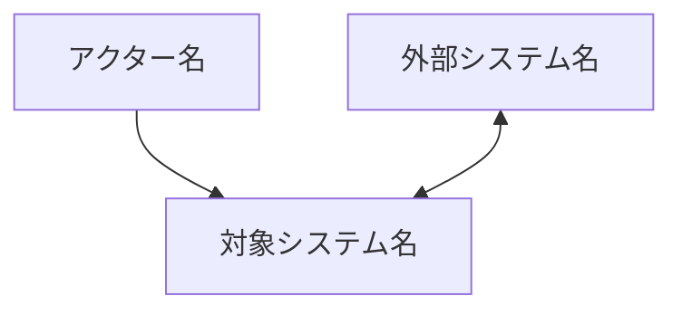
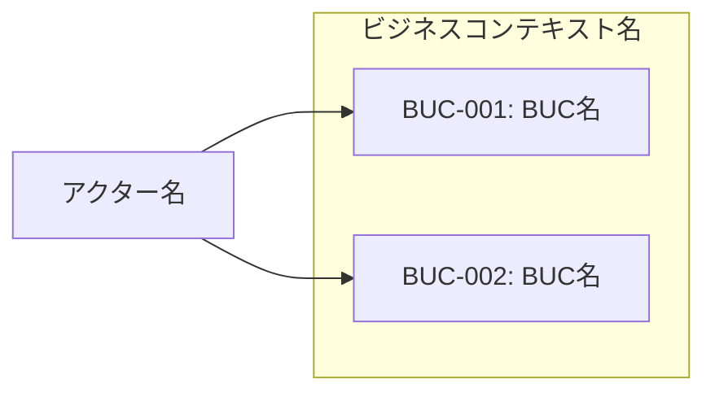
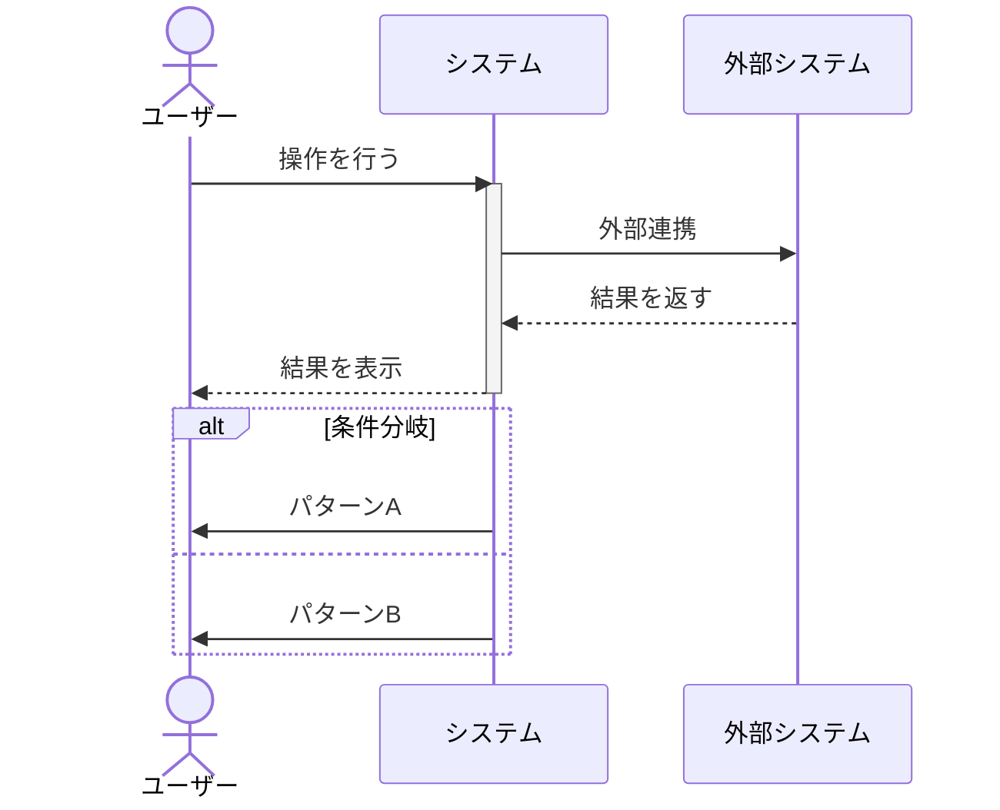
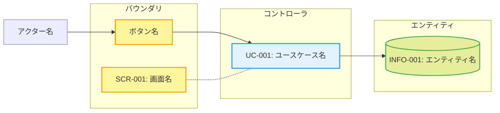
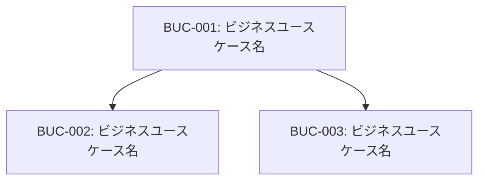
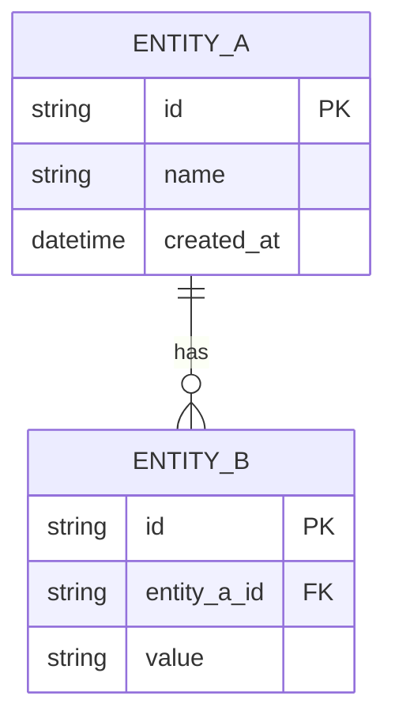
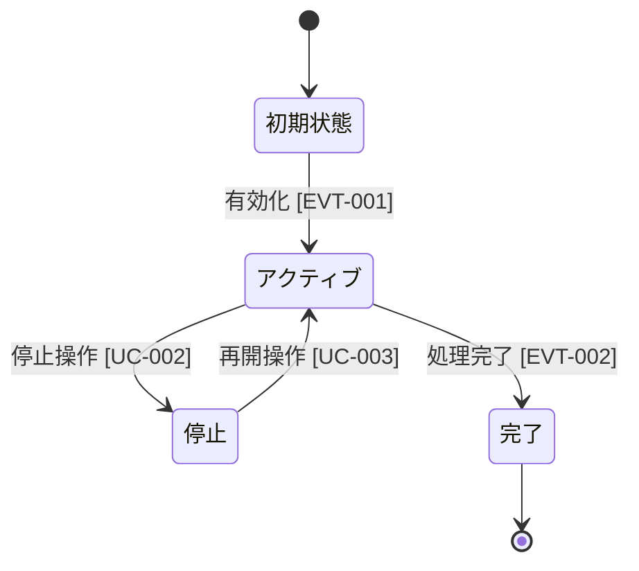

# Mermaid図テンプレート

YAMLがSSoT。Mermaid図はYAMLから生成されるビューとして扱う。YAML更新時はMermaid図も必ず再生成する。

## 1. システムコンテキスト図

アクター・外部システム・対象システムの関係を表現する。overview.mdで使用。

## 2. ビジネスコンテキスト図

業務と関係者の横並び関係。contexts/{name}.mdで使用。

## 3. 業務フロー（シーケンス図）

BUCごとのアクター間やりとりを時系列で表現。

分岐が多い場合は `alt` / `opt` を使い、さらに複雑な場合はフローチャートに切り替える。

## 4. ロバストネス図（UC複合図の代替）

UCごとのboundary/control/entity関係を `classDef` の色分けで表現。

## 5. ビジネスユースケース図

BUC間の依存関係。

## 6. ER図（情報モデル）

shared/information-model.mdで使用。

## 7. 状態遷移図

shared/state-models.mdで使用。遷移のトリガーにEVT-*/UC-* IDを記載する。

