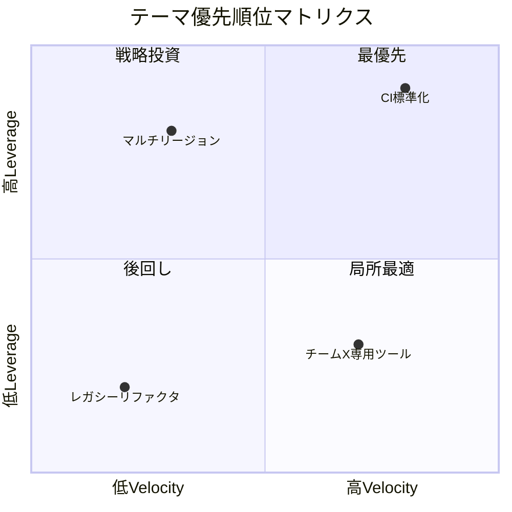

# 優先順位付けガイド

プラットフォームチームのロードマップテーマを、ステークホルダー要求・技術的制約・チームキャパシティを考慮して優先順位付けする。

## Leverage × Velocity マトリクス

プラットフォームの価値は「てこの原理（Leverage）」と「速度向上（Velocity）」に集約される。この2軸でテーマを評価する。

### Leverage（波及効果）

この施策が影響を与えるチーム数・システム数・開発者数。プラットフォーム固有の価値指標。

| スコア | 基準 |
|--------|------|
| 5 | 全チーム（10+チーム）に影響 |
| 4 | 大多数のチーム（5-9チーム）に影響 |
| 3 | 複数チーム（3-4チーム）に影響 |
| 2 | 少数チーム（1-2チーム）に影響 |
| 1 | 自チームのみ |

### Velocity（速度向上）

この施策が利用者（開発者・ビジネスサイド・オペレーション問わず）の日常業務をどれだけ加速するか。認知負荷・業務負荷の削減度合いも含む。

| スコア | 基準 |
|--------|------|
| 5 | 手動作業の完全自動化、または日単位の時間短縮 |
| 4 | 大幅な時間短縮（50%以上）またはエラー削減 |
| 3 | 中程度の改善、複数ステップの簡略化 |
| 2 | 小幅な改善、既存ワークフローの微調整 |
| 1 | 改善はあるが開発者には直接見えにくい |

### 4象限の解釈

```
高Leverage × 高Velocity → 最優先（Quick Wins / High Impact）
  例: 共通CIパイプラインの標準テンプレート提供、全社横断のオペレーション自動化基盤

高Leverage × 低Velocity → 戦略投資（Strategic Bets）
  例: インフラのマルチリージョン対応、顧客データ基盤の統合
  → 長期的価値は高いが即効性は低い。段階的に投資

低Leverage × 高Velocity → 局所最適（Team-Specific Wins）
  例: 特定チーム向けのカスタムツール、CS向けトラブルシュートダッシュボード
  → 対象チーム・部門には喜ばれるが組織全体への波及は限定的。リクエスト元との協働で実現を検討

低Leverage × 低Velocity → 後回し（Deprioritize）
  例: 利用者の少ない内部ツールのリファクタリング
  → 他に着手すべきことがある限り後回し
```

### Mermaid出力例



## Cost of Delay（遅延コスト）

優先順位マトリクスだけでは順序を決められない場合がある。「着手を遅らせたときに失われる価値」を評価して順序を調整する。

### 評価の3パターン

| パターン | 特徴 | 対応 |
|---------|------|------|
| 時間感応型 | 遅れるほど価値が急速に減衰（例: 規制対応の期限） | 期限から逆算して着手時期を確定 |
| 線形減衰型 | 遅れるほど徐々にコストが増加（例: 技術的負債の利子） | 他テーマとの相対比較で順序決定 |
| 時間非依存型 | いつ着手しても価値は変わらない（例: UIの改善） | 他の要因で順序決定 |

## テーマ分類のバランス

健全なロードマップは以下の分類にバランスよくテーマを配置する。偏りは持続可能性を損なうサイン。

| 分類 | 目安配分 | 説明 |
|------|---------|------|
| Golden Path | 25-35% | 利用者が最頻で踏む経路の標準化・自動化（開発フロー、業務フロー問わず） |
| Foundation | 20-30% | インフラ基盤、セキュリティ、可観測性 |
| User Experience | 15-25% | 利用者体験の改善（ツーリング、ドキュメント、オンボーディング。開発者に限らない） |
| Tech Debt | 10-20% | 計画的な負債返済 |
| Support & Ops | 10-15% | 運用負荷削減、セルフサービス化 |

配分は固定ではない。チームの成熟度、プラットフォームのフェーズ（立ち上げ期はFoundation多め、安定期はGolden Path多め）、価値提供先の構成（ビジネスサイド比率が高い場合はUX/Golden Pathの配分を調整）に応じて調整する。

## 依存関係の4分類

テーマの実行順序を決める際、依存関係のタイプを区別して対処する。

| タイプ | 例 | 緩和策 |
|--------|-----|--------|
| Feature依存 | テーマBはテーマAの成果物を前提とする | 順序を固定し、Gantt上で明示 |
| Technical依存 | 特定のインフラ変更が前提 | 前提作業を別テーマまたはSpike として先行着手 |
| Resource依存 | 特定スキルセットが必要 | スキル習得の時間を計画に組み込む、または外部支援 |
| External依存 | ベンダーのAPI提供待ち、他チームの作業完了待ち | バッファを設定、代替案を用意、フォールバック設計 |

External依存はプラットフォームチームが最もコントロールしにくい。緩和策なしの外部依存がクリティカルパス上にある場合、リスクフラグを付与してレビュー時に重点確認する。

## キャパシティ配分

### 推奨配分

```
ロードマップ作業:    60-70%
メンテナンス・運用:   15-20%
サポート・問い合わせ: 5-10%
バッファ（予備）:     10-15%
```

バッファは「何も起きなかった場合に次の優先テーマに充てる時間」であり、最初からテーマに割り当ててはいけない。バッファを削ってテーマを詰め込んだロードマップは、最初の想定外で破綻する。

### キャパシティの見積もり

- チームメンバー数 × 稼働日数 × 上記配分率 でざっくり算出
- 個人の有給、研修、採用活動なども考慮する（実効率は通常70-80%）
- 過去の実績があれば、計画vs実績の比率で補正する
