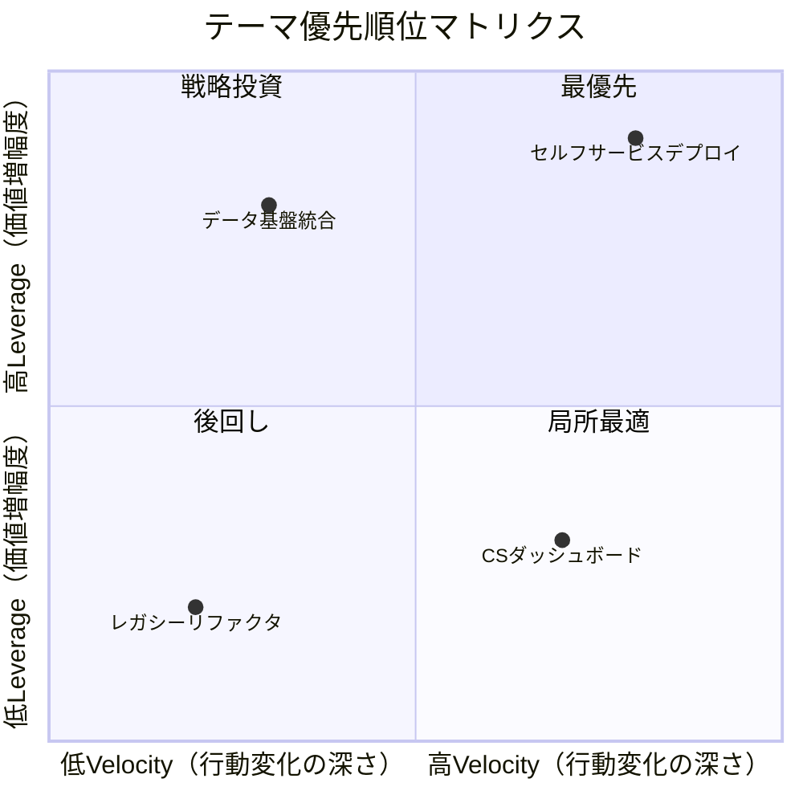

# 優先順位付けガイド

プラットフォームチームのロードマップテーマを、ステークホルダー要求・技術的制約・チームキャパシティを考慮して優先順位付けする。

## Leverage × Velocity マトリクス

プラットフォームの価値は「てこの原理（Leverage）」と「速度向上（Velocity）」に集約される。この2軸でテーマを評価する。

### Leverage（価値増幅度）

この施策がビジネス価値をどれだけ増幅するか。社内顧客の行動変化が最終顧客の価値にどの程度直結するかで評価する。

| スコア | 基準 | 具体例 |
|--------|------|--------|
| 5 | 最終顧客への価値に直結し、全社KPIに影響する | 全プロダクトチームのリリース速度向上→顧客への機能提供加速 |
| 4 | 複数部門の社内顧客の行動を変え、最終顧客価値に間接的に寄与する | セールス・CSの業務効率化→顧客対応品質の向上 |
| 3 | 特定部門の社内顧客の行動を変え、最終顧客への影響が部分的にある | 特定プロダクトチームの開発体験改善→そのプロダクトの品質向上 |
| 2 | 社内顧客の行動変化が限定的で、最終顧客への波及が薄い | 少数チームの運用負荷軽減 |
| 1 | 自チーム内の改善に留まり、社内顧客の行動変化を伴わない | 内部ツールのリファクタリング |

### Velocity（行動変化の深さ）

この施策が社内顧客の行動をどれだけ深く変えるか。「従来不可能だったことが可能になる」変化は、「既存業務が速くなる」変化より価値が高い。

| スコア | 基準 | 具体例 |
|--------|------|--------|
| 5 | 社内顧客が新しいケイパビリティを獲得する（従来不可能→可能に） | 開発者がインフラ変更をセルフサービスで実行できるようになる |
| 4 | 社内顧客の意思決定や判断の質が大幅に変わる | CSチームがリアルタイムで顧客影響を把握し能動的に対応できるようになる |
| 3 | 既存業務の大幅効率化（50%以上の負荷削減） | オペレーションチームの定型作業が自動化され、例外対応に集中できるようになる |
| 2 | 既存業務の改善（負荷削減はあるがワークフローの本質は変わらない） | 既存ツールのUI改善で操作ステップが減る |
| 1 | 行動変化なし（内部品質の向上のみ） | コードベースのリファクタリング |

### 4象限の解釈

```
高Leverage × 高Velocity → 最優先（Quick Wins / High Impact）
  例: 全プロダクトチームがセルフサービスでデプロイ可能になる基盤（全社KPI直結 × 新ケイパビリティ獲得）

高Leverage × 低Velocity → 戦略投資（Strategic Bets）
  例: 顧客データ基盤の統合（全社的な意思決定の質は上がるが、既存業務フローの本質的変化は段階的）
  → 最終顧客価値への寄与は高いが、社内顧客の行動変化が段階的。マイルストーンを刻んで投資

低Leverage × 高Velocity → 局所最適（Team-Specific Wins）
  例: CSチーム向けトラブルシュートダッシュボード（CS限定だが、顧客問い合わせ対応が根本的に変わる）
  → 対象の社内顧客には深い行動変化をもたらすが、全社への波及は限定的。リクエスト元との協働で実現を検討

低Leverage × 低Velocity → 後回し（Deprioritize）
  例: 利用者の少ない内部ツールのリファクタリング（社内顧客の行動変化なし × 最終顧客への波及なし）
  → 他に着手すべきことがある限り後回し
```

### 優先順位一覧表

優先順位の判断と意思決定には以下の表形式を主に使用する。Mermaid図は補助的な可視化として併用する。

| テーマ | Leverage | Velocity | 象限 | Cost of Delay | 優先度 |
|--------|----------|----------|------|---------------|--------|
| {テーマ名} | {1-5} | {1-5} | {最優先/戦略投資/局所最適/後回し} | {時間感応/線形減衰/時間非依存} | {高/中/低} |

### Mermaid出力例（補助）



## Cost of Delay（遅延コスト）

優先順位マトリクスだけでは順序を決められない場合がある。「着手を遅らせたときに失われる価値」を評価して順序を調整する。

### 評価の3パターン

| パターン | 特徴 | 対応 |
|---------|------|------|
| 時間感応型 | 遅れるほど価値が急速に減衰（例: 規制対応の期限） | 期限から逆算して着手時期を確定 |
| 線形減衰型 | 遅れるほど徐々にコストが増加（例: 技術的負債の利子） | 他テーマとの相対比較で順序決定 |
| 時間非依存型 | いつ着手しても価値は変わらない（例: UIの改善） | 他の要因で順序決定 |

## テーマ分類のバランス

健全なロードマップは以下の分類にバランスよくテーマを配置する。偏りは持続可能性を損なうサイン。

| 分類 | 目安配分 | 説明 |
|------|---------|------|
| Golden Path | 25-35% | 利用者が最頻で踏む経路の標準化・自動化（開発フロー、業務フロー問わず） |
| Foundation | 20-30% | インフラ基盤、セキュリティ、可観測性 |
| User Experience | 15-25% | 利用者体験の改善（ツーリング、ドキュメント、オンボーディング。開発者に限らない） |
| Tech Debt | 10-20% | 計画的な負債返済 |
| Support & Ops | 10-15% | 運用負荷削減、セルフサービス化 |

配分は固定ではない。チームの成熟度、プラットフォームのフェーズ（立ち上げ期はFoundation多め、安定期はGolden Path多め）、価値提供先の構成（ビジネスサイド比率が高い場合はUX/Golden Pathの配分を調整）に応じて調整する。

## 依存関係の4分類

テーマの実行順序を決める際、依存関係のタイプを区別して対処する。

| タイプ | 例 | 緩和策 |
|--------|-----|--------|
| Feature依存 | テーマBはテーマAの成果物を前提とする | 順序を固定し、Gantt上で明示 |
| Technical依存 | 特定のインフラ変更が前提 | 前提作業を別テーマまたはSpike として先行着手 |
| Resource依存 | 特定スキルセットが必要 | スキル習得の時間を計画に組み込む、または外部支援 |
| External依存 | ベンダーのAPI提供待ち、他チームの作業完了待ち | バッファを設定、代替案を用意、フォールバック設計 |

External依存はプラットフォームチームが最もコントロールしにくい。緩和策なしの外部依存がクリティカルパス上にある場合、リスクフラグを付与してレビュー時に重点確認する。

## キャパシティ配分

### 推奨配分

```
ロードマップ作業:    60-70%
メンテナンス・運用:   15-20%
サポート・問い合わせ: 5-10%
バッファ（予備）:     10-15%
```

バッファは「何も起きなかった場合に次の優先テーマに充てる時間」であり、最初からテーマに割り当ててはいけない。バッファを削ってテーマを詰め込んだロードマップは、最初の想定外で破綻する。

### キャパシティの見積もり

- チームメンバー数 × 稼働日数 × 上記配分率 でざっくり算出
- 個人の有給、研修、採用活動なども考慮する（実効率は通常70-80%）
- 過去の実績があれば、計画vs実績の比率で補正する
