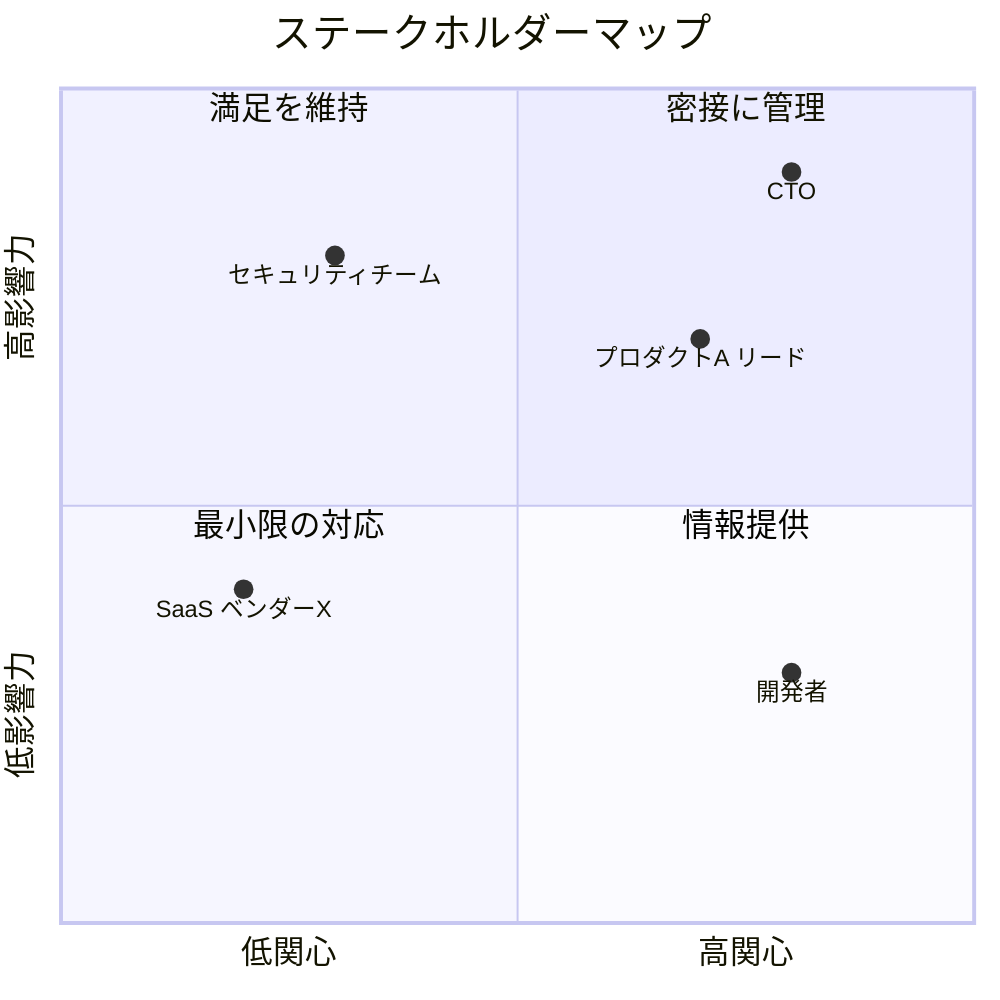

# ステークホルダー分析ガイド

プラットフォームチームが抱えるステークホルダーを構造的に分析し、ロードマップへの入力として整理する。

## プラットフォームチームの典型的なステークホルダー

### 社内 — エンジニアリング

| カテゴリ | 例 | 典型的な関心事 |
|---------|-----|--------------|
| 経営層 | CTO, VP of Engineering | ROI、コスト最適化、戦略整合、リスク管理 |
| プロダクトチーム | Stream-aligned teams | 開発速度、セルフサービス、安定性 |
| SRE / インフラ | SREチーム、インフラチーム | 信頼性、可観測性、インシデント削減 |
| セキュリティ | 情報セキュリティチーム | コンプライアンス、脆弱性管理、ガバナンス |
| データチーム | データエンジニア、ML エンジニア | データパイプライン、計算リソース |
| QA | テストチーム | テスト環境、CI/CD品質ゲート |
| 新規参画者 | 新メンバー、新チーム | オンボーディング体験、ドキュメント |

### 社内 — ビジネスサイド・バックオフィス

プラットフォームの価値提供先は開発者だけではない。SaaS企業では、セールス・CS・オペレーション部門もプラットフォームの直接的な利用者・受益者になりうる。これらの部門の要求を見落とすと、プラットフォームの組織的な価値が過小評価される。

| カテゴリ | 例 | 典型的な関心事 |
|---------|-----|--------------|
| セールス | 営業チーム、プリセールス | デモ環境、トライアル環境の迅速な構築、顧客向けAPI/連携機能の可用性 |
| カスタマーサクセス | CSチーム、テクニカルサポート | 顧客環境の可視化、トラブルシュートツール、顧客データへのアクセス |
| オペレーション | 各種業務オペレーション | 業務ワークフローの自動化、手作業の削減、SaaS管理ツール連携 |
| 経営企画・ファイナンス | CFO、経営企画 | コスト可視化、利用量ベースの課金データ、予算計画のためのデータ |
| 法務・コンプライアンス | 法務部、内部監査 | データ保持ポリシー、監査ログ、規制対応 |

### 社外

| カテゴリ | 例 | 典型的な関心事 |
|---------|-----|--------------|
| 最終顧客 | SaaSのエンドユーザー | プロダクトの信頼性、機能提供速度、パフォーマンス |
| クラウドベンダー | AWS, GCP, Azure | サービスアップデート、コスト、SLA |
| SaaSプロバイダー | Datadog, PagerDuty等 | API互換性、利用量、契約 |
| パートナー企業 | API連携先、業務委託先 | インテグレーション安定性、仕様変更通知 |
| 規制当局 | 業界規制機関 | コンプライアンス要件、監査対応 |

## ステークホルダーマッピング手法

### 4象限分析（影響力 × 関心度）

```
高影響力 × 高関心 → 密接に管理（Manage Closely）
  経営層、主要プロダクトチームリード、CSマネージャー
  → 定期的な1on1、意思決定への参加、ロードマップレビュー

高影響力 × 低関心 → 満足を維持（Keep Satisfied）
  セキュリティチーム、コンプライアンス部門、法務
  → 要所での報告、ポリシー適合の保証

低影響力 × 高関心 → 情報提供（Keep Informed）
  個々の開発者、オペレーション担当者、新メンバー
  → 定期的なニュースレター、オフィスアワー、ドキュメント

低影響力 × 低関心 → 最小限の対応（Monitor）
  間接的な利用者、サポートチーム
  → 必要時のみ連絡
```

### Mermaid出力例



## 関わりの実態の深掘り

ステークホルダーを列挙・分類した後、各ステークホルダーとの**実際の関わり方**を確認する。名目上の役割と運用実態はしばしば乖離するため、以下の質問で実態を把握する:

1. **期待と非期待の明確化** — 「このステークホルダーに対して、あなたのチームは何を期待し、何を期待していないか」
2. **自チーム完結領域の特定** — 「このステークホルダーの業務のうち、自チームで完結する領域はどこか」
3. **名目と実態のギャップ** — 「組織図上の役割分担と、実際の運用にギャップはないか」

この情報はPhase 4のテーマ策定やレビュー時の判断基盤になる。実態を把握していないと、存在しない依存関係を前提にした誤ったテーマ設計やレビュー指摘が発生する。

## 要求の収集と構造化

各ステークホルダーの要求を以下のフォーマットで整理する:

```yaml
stakeholder: "プロダクトAチーム"
category: "社内/プロダクトチーム"
quadrant: "密接に管理"
demands:
  - id: "DMD-001"
    summary: "デプロイパイプラインの高速化"
    detail: "現在のデプロイに30分かかり、日次リリースの障壁になっている"
    priority: "high"  # ステークホルダー視点での優先度
    themes: []  # Phase 4で紐付け
  - id: "DMD-002"
    summary: "ステージング環境のセルフサービス化"
    detail: "新機能検証のたびにプラットフォームチームへの依頼が発生"
    priority: "medium"
    themes: []
conflicts:
  - with: "セキュリティチーム"
    description: "デプロイ高速化 vs セキュリティスキャン必須"
    resolution: ""  # Phase 4で解決策を検討
```

## コンフリクト解決のアプローチ

ステークホルダー間の要求が矛盾する場合、以下の順序で解決策を検討する:

1. **両立可能か** — 技術的に両方の要求を満たせる方法はないか（例: セキュリティスキャンの並列実行でデプロイ速度を維持）
2. **段階的実現** — 片方を先に、もう片方を次フェーズで対応できないか
3. **トレードオフの明示** — 両立不可能な場合、トレードオフを数値化してステークホルダーに判断を委ねる
4. **エスカレーション** — チーム内で解決できない場合、経営層の判断を仰ぐ

コンフリクトの解決策はロードマップのテーマに直接影響するため、Phase 4の前に合意を得ることが重要。
