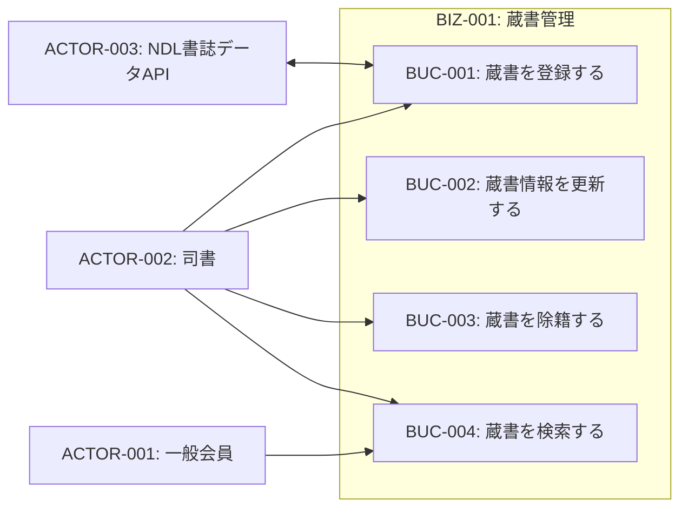
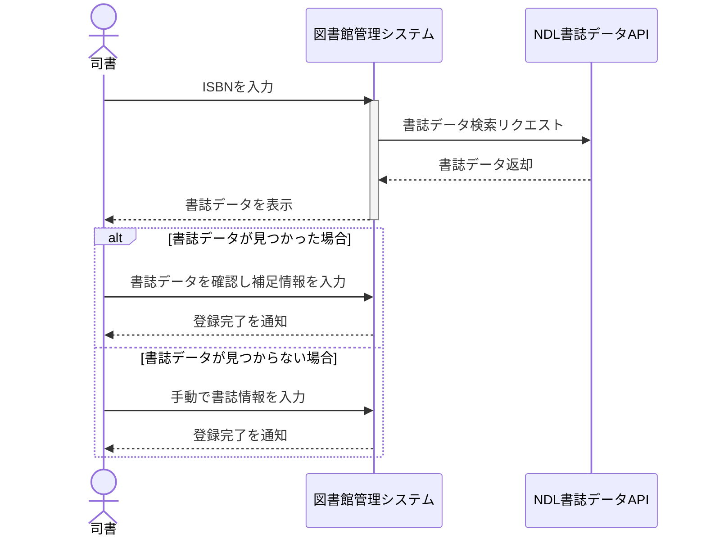
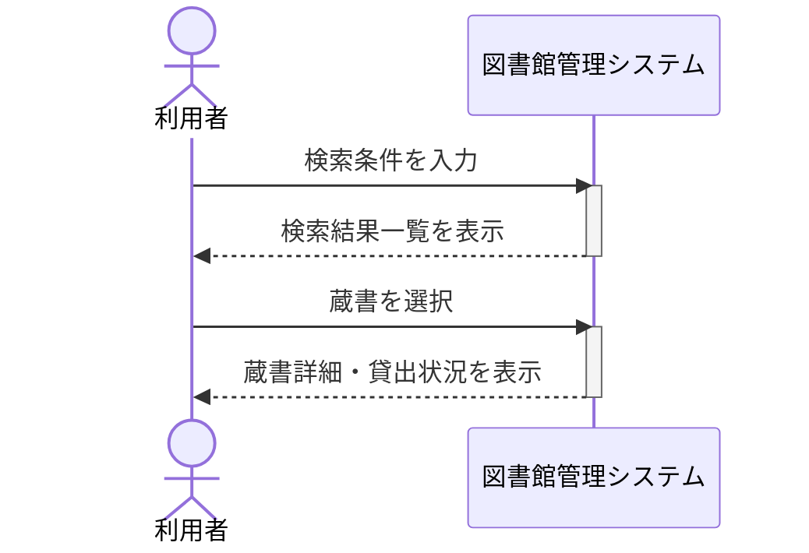
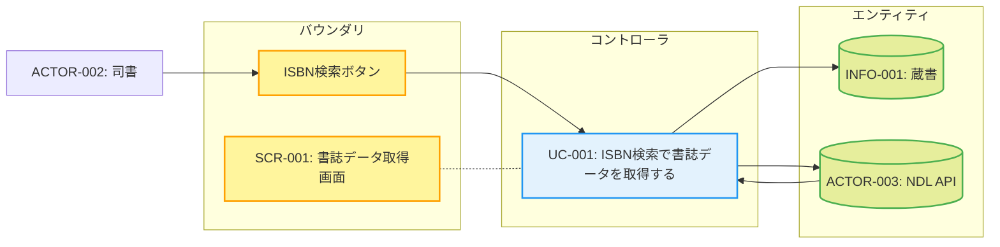
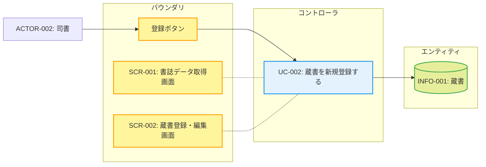

# 蔵書管理コンテキスト

## ビジネスコンテキスト図

```mermaid
graph LR
    actor2["ACTOR-002: 司書"]
    actor1["ACTOR-001: 一般会員"]
    ext1["ACTOR-003: NDL書誌データAPI"]

    subgraph biz1["BIZ-001: 蔵書管理"]
        buc1["BUC-001: 蔵書を登録する"]
        buc2["BUC-002: 蔵書情報を更新する"]
        buc3["BUC-003: 蔵書を除籍する"]
        buc4["BUC-004: 蔵書を検索する"]
    end

    actor2 --> buc1
    actor2 --> buc2
    actor2 --> buc3
    actor2 --> buc4
    actor1 --> buc4
    ext1 <--> buc1
```

## 業務フロー

### BUC-001: 蔵書を登録する

```mermaid
sequenceDiagram
    actor Librarian as 司書
    participant S as 図書館管理システム
    participant NDL as NDL書誌データAPI

    Librarian->>S: ISBNを入力
    activate S
    S->>NDL: 書誌データ検索リクエスト
    NDL-->>S: 書誌データ返却
    S-->>Librarian: 書誌データを表示
    deactivate S

    alt 書誌データが見つかった場合
        Librarian->>S: 書誌データを確認し補足情報を入力
        S-->>Librarian: 登録完了を通知
    else 書誌データが見つからない場合
        Librarian->>S: 手動で書誌情報を入力
        S-->>Librarian: 登録完了を通知
    end
```

### BUC-004: 蔵書を検索する

```mermaid
sequenceDiagram
    actor User as 利用者
    participant S as 図書館管理システム

    User->>S: 検索条件を入力
    activate S
    S-->>User: 検索結果一覧を表示
    deactivate S
    User->>S: 蔵書を選択
    activate S
    S-->>User: 蔵書詳細・貸出状況を表示
    deactivate S
```

## ロバストネス図

### UC-001: ISBN検索で書誌データを取得する

```mermaid
flowchart LR
    classDef boundary fill:#fff59d,stroke:#ffa000,stroke-width:2px
    classDef control fill:#e3f2fd,stroke:#2196f3,stroke-width:2px
    classDef entity fill:#e6ee9c,stroke:#4caf50,stroke-width:2px

    actor["ACTOR-002: 司書"]

    subgraph boundarySg["バウンダリ"]
        scr1["SCR-001: 書誌データ取得画面"]:::boundary
        btn1["ISBN検索ボタン"]:::boundary
    end

    subgraph controlSg["コントローラ"]
        ctrl1["UC-001: ISBN検索で書誌データを取得する"]:::control
    end

    subgraph entitySg["エンティティ"]
        info1[("INFO-001: 蔵書")]:::entity
        ext1[("ACTOR-003: NDL API")]:::entity
    end

    actor --> btn1
    btn1 --> ctrl1
    ctrl1 --> ext1
    ext1 --> ctrl1
    ctrl1 --> info1
    scr1 -.- ctrl1
```

### UC-002: 蔵書を新規登録する

```mermaid
flowchart LR
    classDef boundary fill:#fff59d,stroke:#ffa000,stroke-width:2px
    classDef control fill:#e3f2fd,stroke:#2196f3,stroke-width:2px
    classDef entity fill:#e6ee9c,stroke:#4caf50,stroke-width:2px

    actor["ACTOR-002: 司書"]

    subgraph boundarySg["バウンダリ"]
        scr1["SCR-001: 書誌データ取得画面"]:::boundary
        scr2["SCR-002: 蔵書登録・編集画面"]:::boundary
        btn1["登録ボタン"]:::boundary
    end

    subgraph controlSg["コントローラ"]
        ctrl1["UC-002: 蔵書を新規登録する"]:::control
    end

    subgraph entitySg["エンティティ"]
        info1[("INFO-001: 蔵書")]:::entity
    end

    actor --> btn1
    btn1 --> ctrl1
    ctrl1 --> info1
    scr1 -.- ctrl1
    scr2 -.- ctrl1
```
