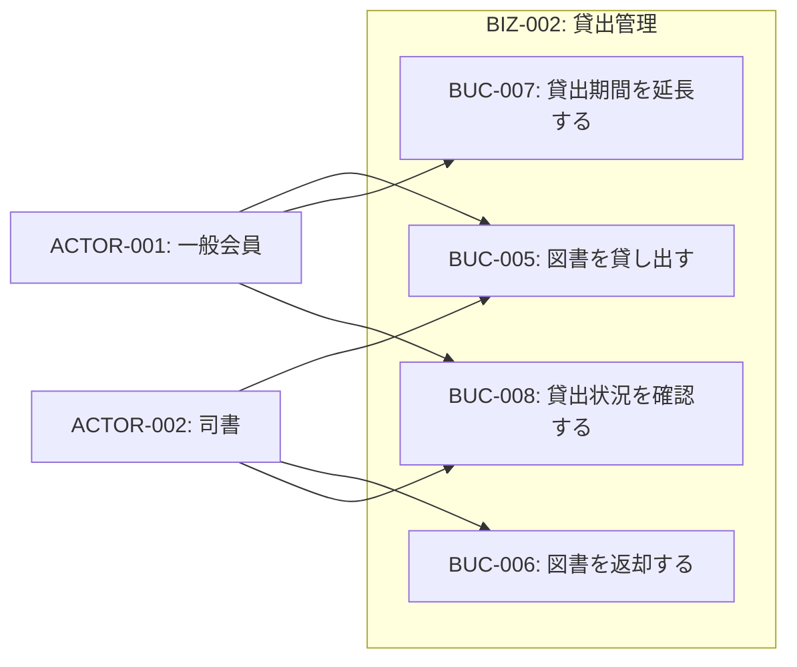
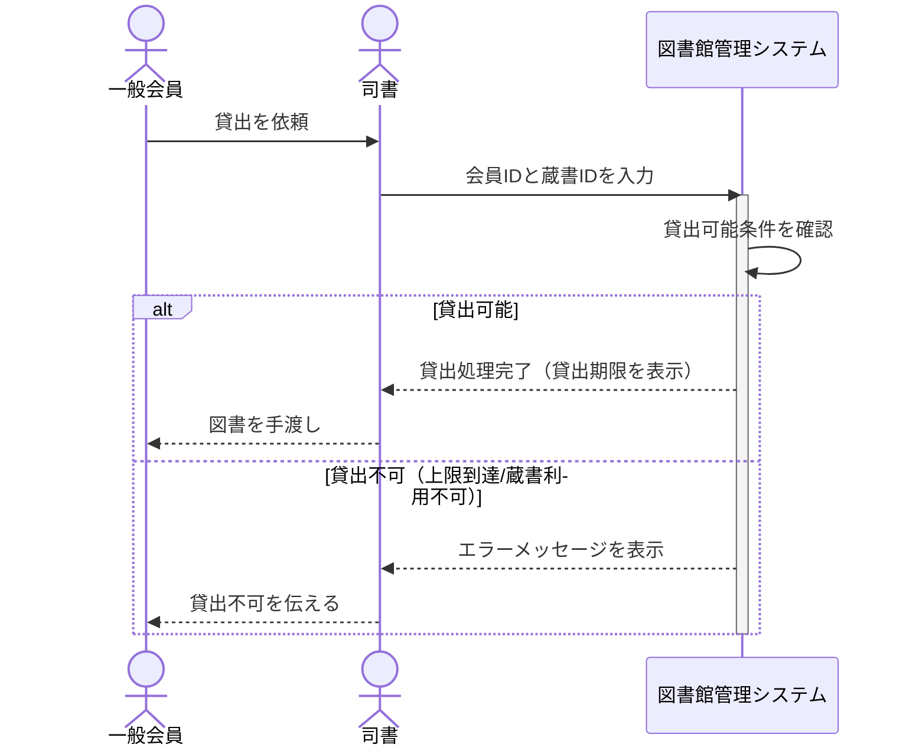
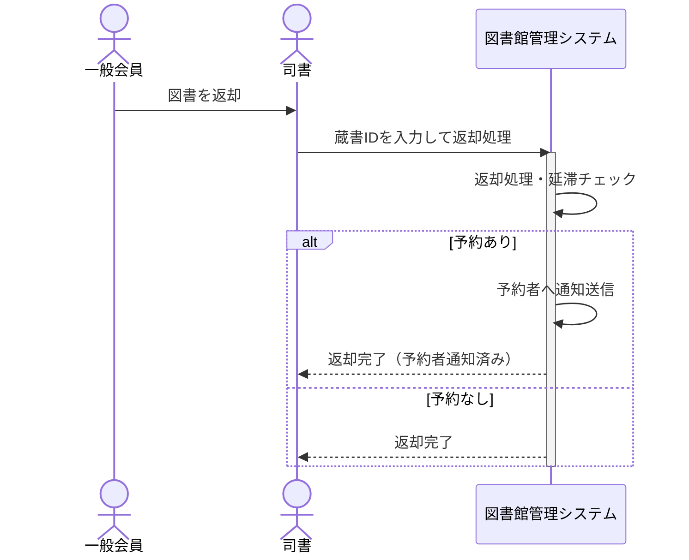
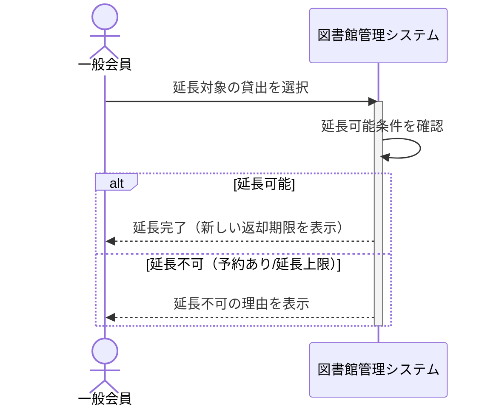
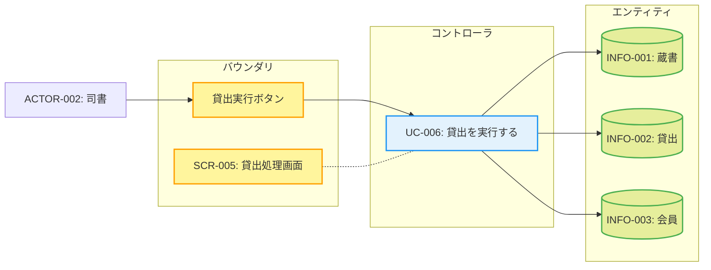
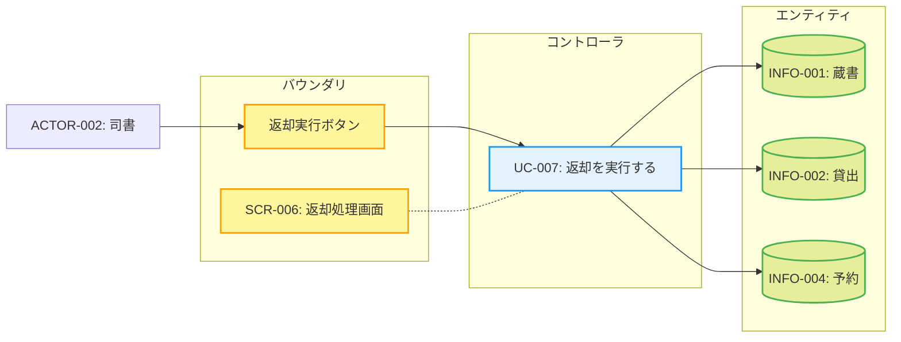

# 貸出管理コンテキスト

## ビジネスコンテキスト図

```mermaid
graph LR
    actor1["ACTOR-001: 一般会員"]
    actor2["ACTOR-002: 司書"]

    subgraph biz2["BIZ-002: 貸出管理"]
        buc5["BUC-005: 図書を貸し出す"]
        buc6["BUC-006: 図書を返却する"]
        buc7["BUC-007: 貸出期間を延長する"]
        buc8["BUC-008: 貸出状況を確認する"]
    end

    actor1 --> buc5
    actor1 --> buc7
    actor1 --> buc8
    actor2 --> buc5
    actor2 --> buc6
    actor2 --> buc8
```

## 業務フロー

### BUC-005: 図書を貸し出す

```mermaid
sequenceDiagram
    actor Member as 一般会員
    actor Librarian as 司書
    participant S as 図書館管理システム

    Member->>Librarian: 貸出を依頼
    Librarian->>S: 会員IDと蔵書IDを入力
    activate S
    S->>S: 貸出可能条件を確認
    alt 貸出可能
        S-->>Librarian: 貸出処理完了（貸出期限を表示）
        Librarian-->>Member: 図書を手渡し
    else 貸出不可（上限到達/蔵書利用不可）
        S-->>Librarian: エラーメッセージを表示
        Librarian-->>Member: 貸出不可を伝える
    end
    deactivate S
```

### BUC-006: 図書を返却する

```mermaid
sequenceDiagram
    actor Member as 一般会員
    actor Librarian as 司書
    participant S as 図書館管理システム

    Member->>Librarian: 図書を返却
    Librarian->>S: 蔵書IDを入力して返却処理
    activate S
    S->>S: 返却処理・延滞チェック
    alt 予約あり
        S->>S: 予約者へ通知送信
        S-->>Librarian: 返却完了（予約者通知済み）
    else 予約なし
        S-->>Librarian: 返却完了
    end
    deactivate S
```

### BUC-007: 貸出期間を延長する

```mermaid
sequenceDiagram
    actor Member as 一般会員
    participant S as 図書館管理システム

    Member->>S: 延長対象の貸出を選択
    activate S
    S->>S: 延長可能条件を確認
    alt 延長可能
        S-->>Member: 延長完了（新しい返却期限を表示）
    else 延長不可（予約あり/延長上限）
        S-->>Member: 延長不可の理由を表示
    end
    deactivate S
```

## ロバストネス図

### UC-006: 貸出を実行する

```mermaid
flowchart LR
    classDef boundary fill:#fff59d,stroke:#ffa000,stroke-width:2px
    classDef control fill:#e3f2fd,stroke:#2196f3,stroke-width:2px
    classDef entity fill:#e6ee9c,stroke:#4caf50,stroke-width:2px

    actor["ACTOR-002: 司書"]

    subgraph boundarySg["バウンダリ"]
        scr5["SCR-005: 貸出処理画面"]:::boundary
        btn1["貸出実行ボタン"]:::boundary
    end

    subgraph controlSg["コントローラ"]
        ctrl1["UC-006: 貸出を実行する"]:::control
    end

    subgraph entitySg["エンティティ"]
        info1[("INFO-001: 蔵書")]:::entity
        info2[("INFO-002: 貸出")]:::entity
        info3[("INFO-003: 会員")]:::entity
    end

    actor --> btn1
    btn1 --> ctrl1
    ctrl1 --> info1
    ctrl1 --> info2
    ctrl1 --> info3
    scr5 -.- ctrl1
```

### UC-007: 返却を実行する

```mermaid
flowchart LR
    classDef boundary fill:#fff59d,stroke:#ffa000,stroke-width:2px
    classDef control fill:#e3f2fd,stroke:#2196f3,stroke-width:2px
    classDef entity fill:#e6ee9c,stroke:#4caf50,stroke-width:2px

    actor["ACTOR-002: 司書"]

    subgraph boundarySg["バウンダリ"]
        scr6["SCR-006: 返却処理画面"]:::boundary
        btn1["返却実行ボタン"]:::boundary
    end

    subgraph controlSg["コントローラ"]
        ctrl1["UC-007: 返却を実行する"]:::control
    end

    subgraph entitySg["エンティティ"]
        info1[("INFO-001: 蔵書")]:::entity
        info2[("INFO-002: 貸出")]:::entity
        info4[("INFO-004: 予約")]:::entity
    end

    actor --> btn1
    btn1 --> ctrl1
    ctrl1 --> info1
    ctrl1 --> info2
    ctrl1 --> info4
    scr6 -.- ctrl1
```
