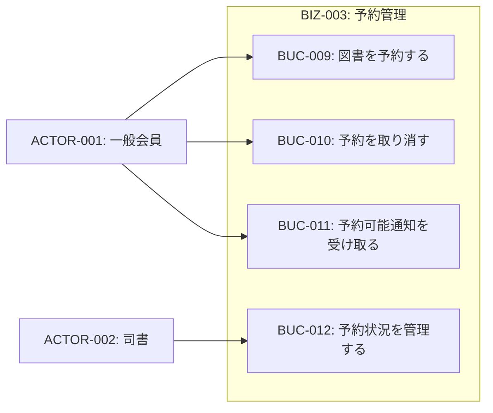
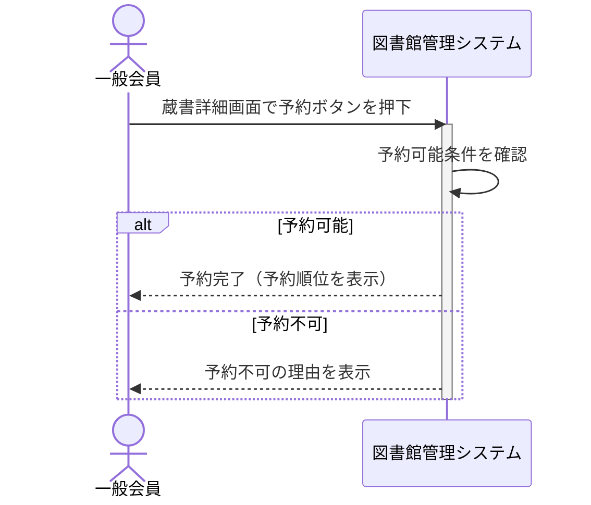
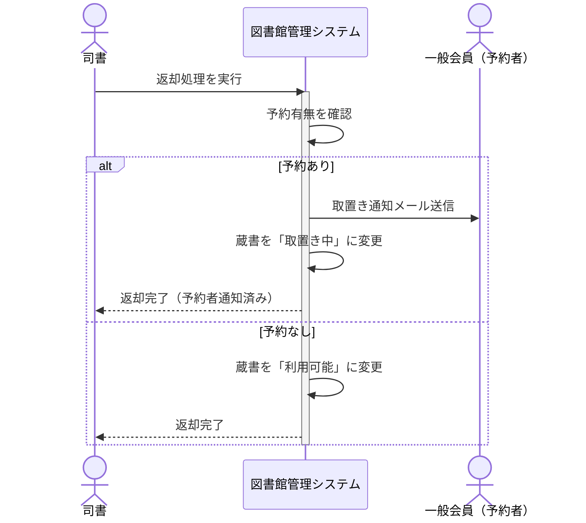
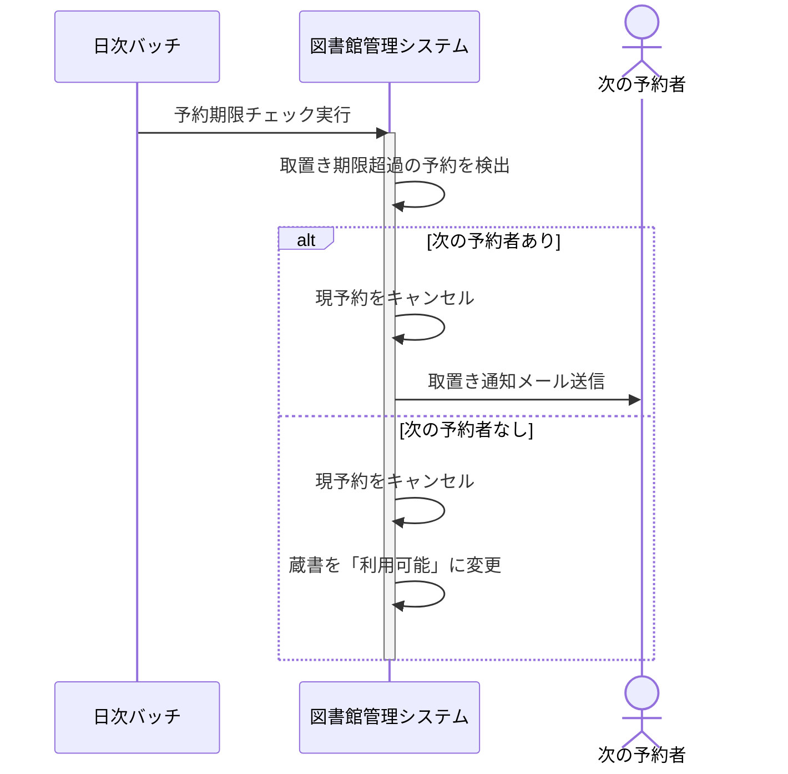
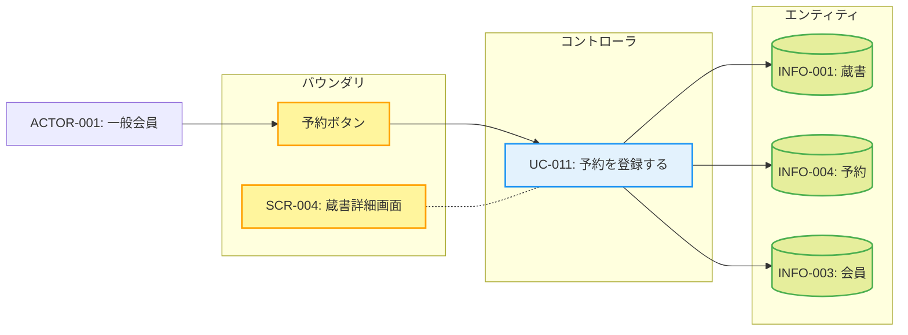
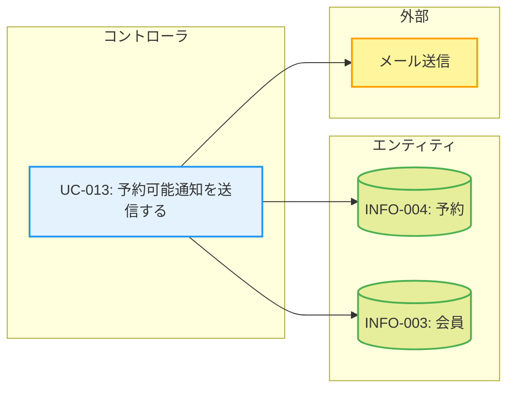

# 予約管理コンテキスト

## ビジネスコンテキスト図

```mermaid
graph LR
    actor1["ACTOR-001: 一般会員"]
    actor2["ACTOR-002: 司書"]

    subgraph biz3["BIZ-003: 予約管理"]
        buc9["BUC-009: 図書を予約する"]
        buc10["BUC-010: 予約を取り消す"]
        buc11["BUC-011: 予約可能通知を受け取る"]
        buc12["BUC-012: 予約状況を管理する"]
    end

    actor1 --> buc9
    actor1 --> buc10
    actor1 --> buc11
    actor2 --> buc12
```

## 業務フロー

### BUC-009: 図書を予約する

```mermaid
sequenceDiagram
    actor Member as 一般会員
    participant S as 図書館管理システム

    Member->>S: 蔵書詳細画面で予約ボタンを押下
    activate S
    S->>S: 予約可能条件を確認
    alt 予約可能
        S-->>Member: 予約完了（予約順位を表示）
    else 予約不可
        S-->>Member: 予約不可の理由を表示
    end
    deactivate S
```

### BUC-011: 予約可能通知を受け取る

```mermaid
sequenceDiagram
    actor Librarian as 司書
    participant S as 図書館管理システム
    actor Member as 一般会員（予約者）

    Librarian->>S: 返却処理を実行
    activate S
    S->>S: 予約有無を確認
    alt 予約あり
        S->>Member: 取置き通知メール送信
        S->>S: 蔵書を「取置き中」に変更
        S-->>Librarian: 返却完了（予約者通知済み）
    else 予約なし
        S->>S: 蔵書を「利用可能」に変更
        S-->>Librarian: 返却完了
    end
    deactivate S
```

### BUC-012: 予約期限切れ処理

```mermaid
sequenceDiagram
    participant Batch as 日次バッチ
    participant S as 図書館管理システム
    actor Member as 次の予約者

    Batch->>S: 予約期限チェック実行
    activate S
    S->>S: 取置き期限超過の予約を検出
    alt 次の予約者あり
        S->>S: 現予約をキャンセル
        S->>Member: 取置き通知メール送信
    else 次の予約者なし
        S->>S: 現予約をキャンセル
        S->>S: 蔵書を「利用可能」に変更
    end
    deactivate S
```

## ロバストネス図

### UC-011: 予約を登録する

```mermaid
flowchart LR
    classDef boundary fill:#fff59d,stroke:#ffa000,stroke-width:2px
    classDef control fill:#e3f2fd,stroke:#2196f3,stroke-width:2px
    classDef entity fill:#e6ee9c,stroke:#4caf50,stroke-width:2px

    actor["ACTOR-001: 一般会員"]

    subgraph boundarySg["バウンダリ"]
        scr4["SCR-004: 蔵書詳細画面"]:::boundary
        btn1["予約ボタン"]:::boundary
    end

    subgraph controlSg["コントローラ"]
        ctrl1["UC-011: 予約を登録する"]:::control
    end

    subgraph entitySg["エンティティ"]
        info1[("INFO-001: 蔵書")]:::entity
        info4[("INFO-004: 予約")]:::entity
        info3[("INFO-003: 会員")]:::entity
    end

    actor --> btn1
    btn1 --> ctrl1
    ctrl1 --> info1
    ctrl1 --> info4
    ctrl1 --> info3
    scr4 -.- ctrl1
```

### UC-013: 予約可能通知を送信する

```mermaid
flowchart LR
    classDef boundary fill:#fff59d,stroke:#ffa000,stroke-width:2px
    classDef control fill:#e3f2fd,stroke:#2196f3,stroke-width:2px
    classDef entity fill:#e6ee9c,stroke:#4caf50,stroke-width:2px

    subgraph controlSg["コントローラ"]
        ctrl1["UC-013: 予約可能通知を送信する"]:::control
    end

    subgraph entitySg["エンティティ"]
        info4[("INFO-004: 予約")]:::entity
        info3[("INFO-003: 会員")]:::entity
    end

    subgraph externalSg["外部"]
        mail["メール送信"]:::boundary
    end

    ctrl1 --> info4
    ctrl1 --> info3
    ctrl1 --> mail
```
