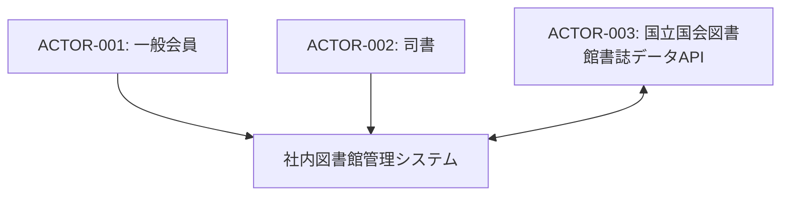
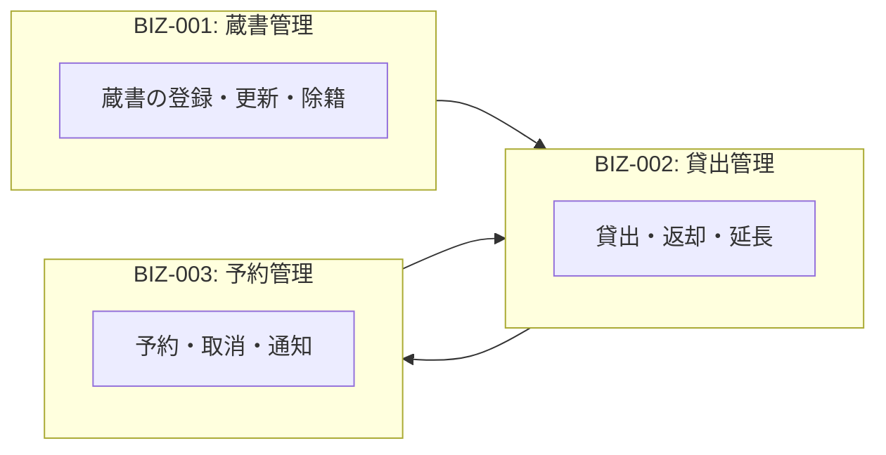

# 社内図書館管理システム - 全体概観

## システムコンテキスト図

## コンテキスト間関係図

## コンテキスト一覧

| ID | コンテキスト名 | 主要アクター | 関連ゴール |
|----|--------------|-------------|-----------|
| BIZ-001 | 蔵書管理 | 司書 | GOAL-001 |
| BIZ-002 | 貸出管理 | 一般会員, 司書 | GOAL-002 |
| BIZ-003 | 予約管理 | 一般会員, 司書 | GOAL-003 |
