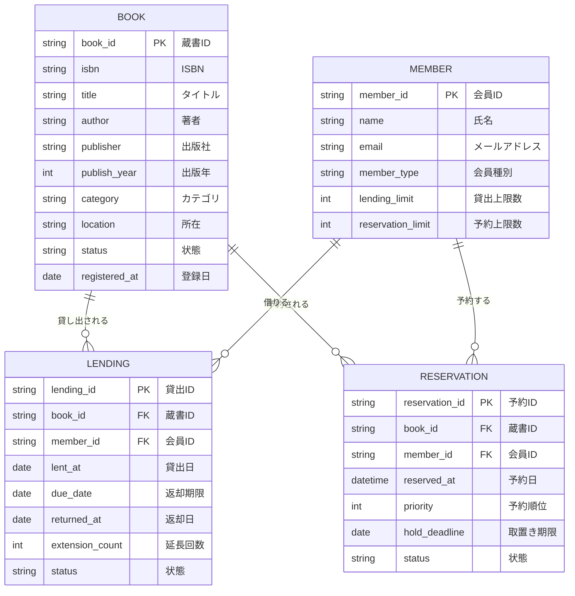

# 情報モデル（コンテキスト横断）

## ER図

## エンティティ一覧

| ID | エンティティ名 | 参照コンテキスト |
|----|--------------|----------------|
| INFO-001 | 蔵書 | BIZ-001, BIZ-002, BIZ-003 |
| INFO-002 | 貸出 | BIZ-002 |
| INFO-003 | 会員 | BIZ-002, BIZ-003 |
| INFO-004 | 予約 | BIZ-002, BIZ-003 |
