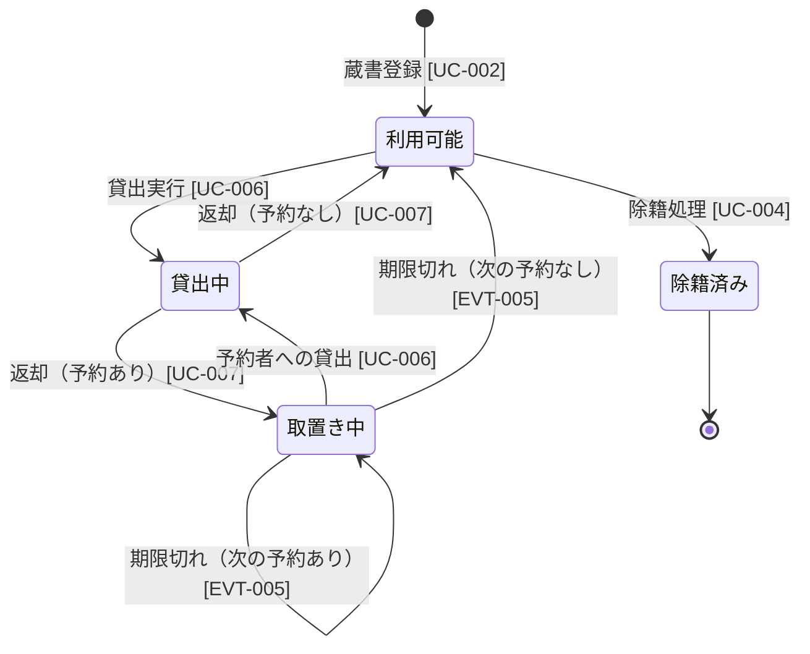
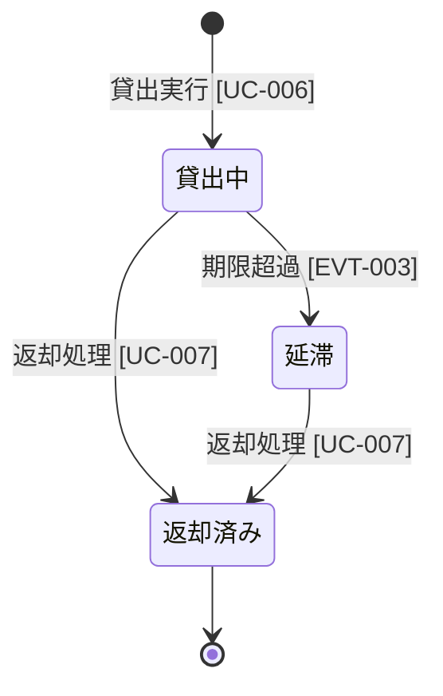
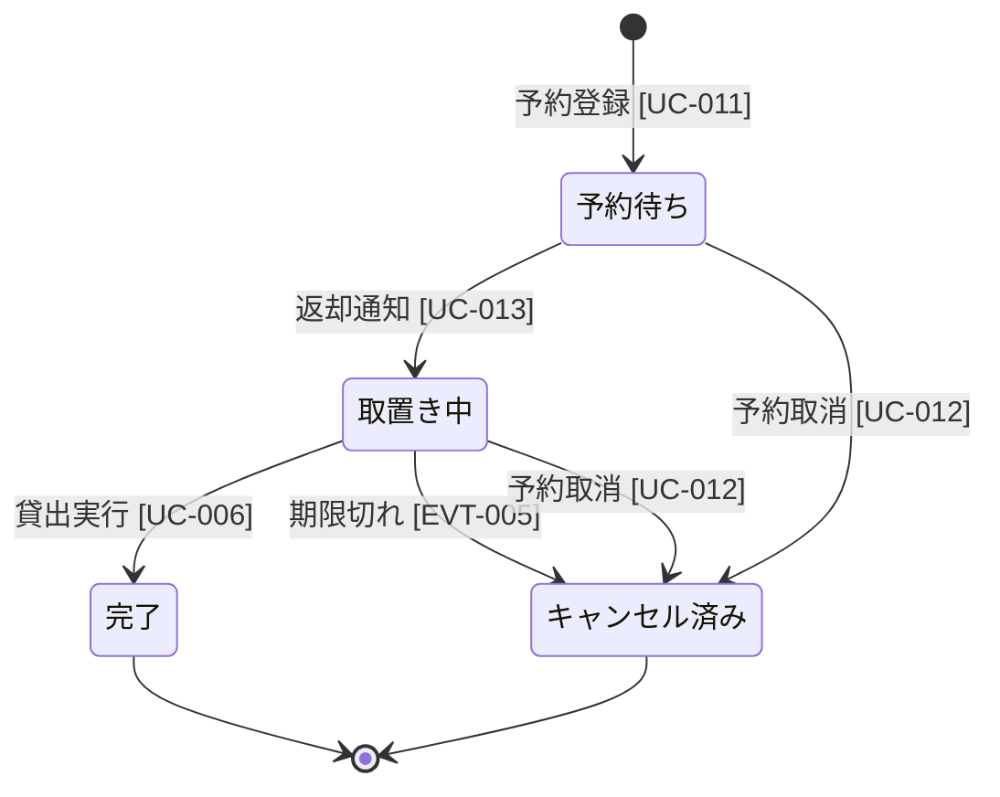

# 状態モデル（コンテキスト横断）

## STATE-001: 蔵書状態

## STATE-002: 貸出状態

## STATE-003: 予約状態

## 状態モデル一覧

| ID | 対象エンティティ | 状態数 | 関連UC/EVT |
|----|----------------|--------|-----------|
| STATE-001 | 蔵書 (INFO-001) | 4 | UC-002, UC-004, UC-006, UC-007, EVT-005 |
| STATE-002 | 貸出 (INFO-002) | 3 | UC-006, UC-007, EVT-003 |
| STATE-003 | 予約 (INFO-004) | 4 | UC-006, UC-011, UC-012, UC-013, EVT-005 |
