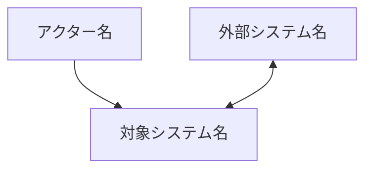
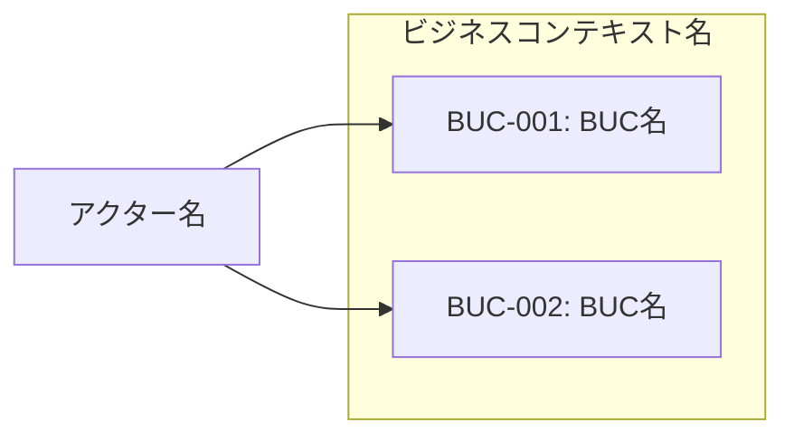
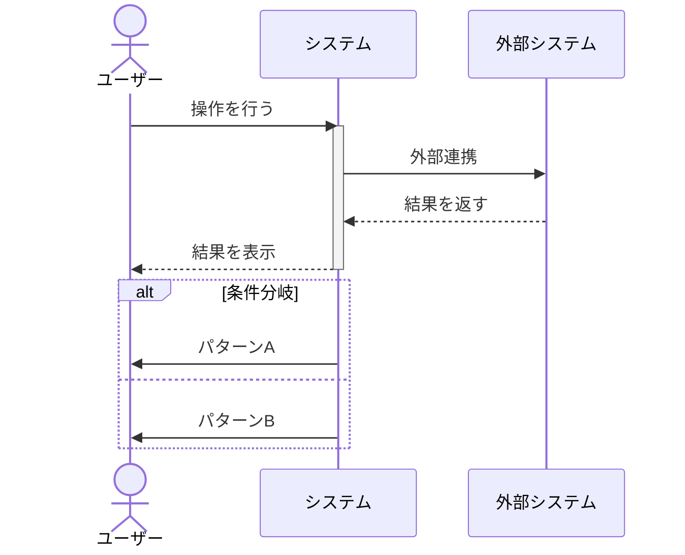
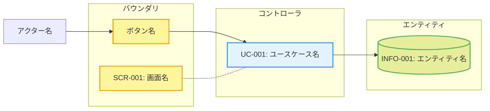
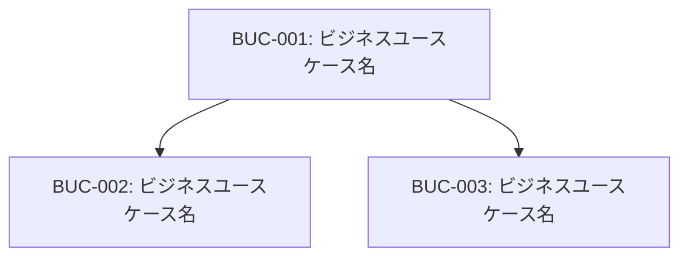
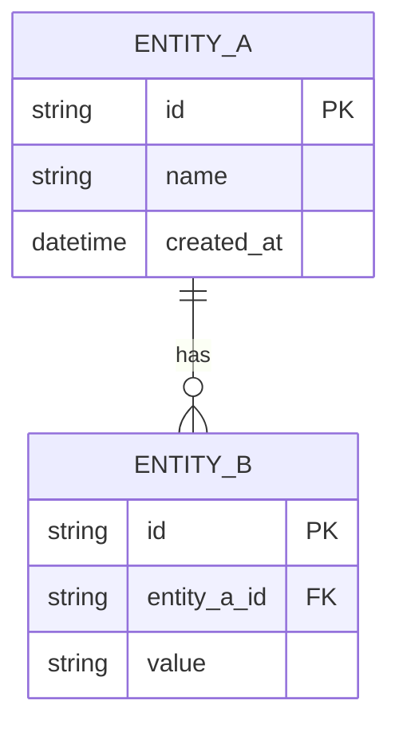
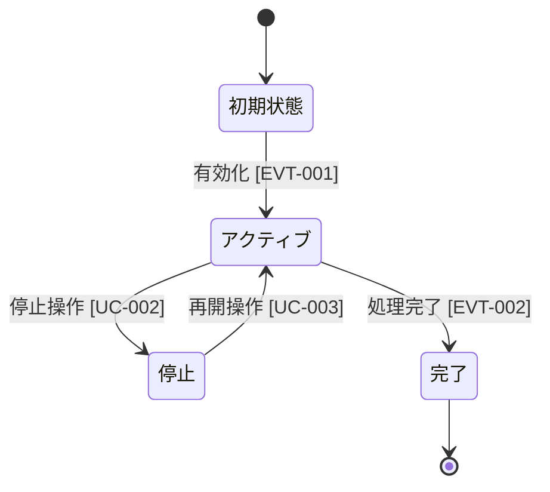

# Spec: RDRA-SDD スキル 技術仕様

## 1. スキルファイル構造

```
dot_claude/skills/rdra-sdd/
├── SKILL.md                          # メインスキル定義（500行以下）
├── agents/
│   └── reviewer.md                   # レビューサブエージェント定義
└── references/
    ├── rdra-schemas.md               # RDRA成果物のYAMLスキーマ
    ├── mermaid-templates.md           # Mermaid図テンプレート集
    ├── sdd-templates.md              # PRD/ADR/Spec テンプレート
    ├── analysis-guide.md             # 分析モード詳細ガイド
    └── implementation-guide.md       # 実装生成モード詳細ガイド
```

## 2. SKILL.md 構成

### フロントマター

```yaml
---
name: rdra-sdd
description: |
  RDRA 3.0に基づく要件定義と仕様駆動開発を支援するスキル。
  5つのモード（分析/仕様作成/実装生成/レビュー/更新）で要件の構造化からコード生成までを一貫して実行する。
  RDRA、要件定義、仕様書作成、SDD、ビジネスユースケース、ユースケース、業務フロー、
  情報モデル、状態遷移、トレーサビリティ、タスク分解、コード生成、受け入れテストなど、
  要件定義・仕様策定・実装生成に関する相談全般でトリガーする。
---
```

### 本体構成（概要）

```
# RDRA-SDD

概要説明（1スキル5モード、RDRA 3.0からSDD実装まで一貫支援）

## モード選択
  ユーザーの意図に応じてモードを判定するロジック

## モード1: 分析（RDRA Analysis）
  概要 + `references/analysis-guide.md` への参照

## モード2: 仕様作成（Spec Writing）
  5 Stepフロー概要

## モード3: 実装生成（Implementation Generation）
  4 Stepフロー概要 + `references/implementation-guide.md` への参照

## モード4: レビュー（Spec Review）
  概要 + `agents/reviewer.md` への委譲

## モード5: 更新（Spec Update）
  4 Stepフロー概要

## 共通事項
  出力ディレクトリ構造、IDスキーマ、トレーサビリティ概要
  スキーマ詳細は `references/rdra-schemas.md`、
  図テンプレートは `references/mermaid-templates.md` を参照
```

## 3. 各モードの詳細フロー

### 3.1 分析モード（RDRA Analysis）

RDRA 3.0のコンテキスト単位のバーティカルスライスで対話的にヒアリングし、4レイヤーを縦貫する成果物を生成する。

#### 全体フロー

```
Phase 1: スコープ把握
  → プロジェクト概要、主要アクター、システム化の目的をヒアリング
  → overview.md のドラフト生成

Phase 2: コンテキストの特定
  → 主要な業務領域を洗い出し、RDRA 3.0のコンテキスト分割を提案
  → ユーザーと合意してコンテキスト一覧を確定

Phase 3: コンテキスト別深掘り（各コンテキストについて繰り返し）
  → §価値: ゴール・要求のヒアリング
  → §環境: BUC・業務フローのヒアリング
  → §境界: UC・画面・イベントのヒアリング
  → §システム: 情報モデル・状態モデル・条件・バリエーションへの参照の特定
  → contexts/{name}.md の生成

Phase 4: 横断モデルの整理
  → shared/information-model.md の生成（全コンテキストから抽出）
  → shared/state-models.md の生成
  → コンテキスト間の整合チェック（同名エンティティの統一、IDの重複チェック）

Phase 5: トレーサビリティ生成
  → traceability.yaml の生成
  → カバレッジサマリの出力（overview.md に追記）
```

#### ヒアリングの原則

- 1フェーズにつき1つのテーマに集中する。複数レイヤーを同時に聞かない
- ユーザーの回答が曖昧な場合は具体例を示して選択肢を提示する
- 各コンテキストの深掘り完了時にMermaid図を提示し、認識合わせを行う
- 暗黙知を引き出すために「他に〜はありますか？」で網羅性を確認する

### 3.2 仕様作成モード（Spec Writing）

RDRA成果物を入力とし、SDD 3文書（PRD/ADR/Spec）を生成する。

#### 5 Step フロー

```
Step 1: RDRA成果物の読み込みと検証
  → rdra/ ディレクトリの構造を確認
  → overview.md, contexts/*.md, shared/*.md, traceability.yaml を読み込み
  → 構造的な不備（欠落ファイル、未定義ID参照）があれば報告し、分析モードへの差し戻しを提案

Step 2: PRD生成
  → RDRA成果物からユーザーストーリー、機能要件、非機能要件を抽出
  → overview.md のゴール・要求を PRD の「背景と課題」「機能要件」にマッピング
  → ユーザーに確認後、specs/prd.md を生成

Step 3: ADR生成
  → 分析フェーズで検出された設計判断ポイントを ADR 候補として提示
  → 典型的なADR候補:
    - アーキテクチャ選定（モノリス vs マイクロサービス等）
    - 技術スタック選定
    - データモデル設計の判断
    - 認証・認可方式
  → ユーザーと対話して判断理由を明確化し、specs/adr/NNN-*.md を生成

Step 4: Spec生成
  → RDRA の UC・画面・イベントを入力とし、技術仕様を生成
  → 各UCについて: API設計、データフロー、エラーハンドリング、非機能要件
  → specs/spec.md を生成

Step 5: トレーサビリティ更新
  → 生成した3文書の仕様項目を traceability.yaml に追記
  → RDRA要素 → PRD要件 → Spec仕様 の traces_to チェーンを構築
  → カバレッジレポートを出力（RDRA要素のうち仕様に反映されていないものを検出）
```

### 3.3 実装生成モード（Implementation Generation）

仕様書を入力とし、タスクリスト・実装コード・ADR・受け入れテストを生成する。SDDの「Specify → Plan → Tasks → Implement」ワークフローをRDRAトレーサビリティ付きで実行する。

#### 4 Step フロー

```
Step 1: 技術スタック・アーキテクチャのヒアリング
  → 使用言語・フレームワーク・インフラ構成をヒアリング
  → ADR候補の自動検出（技術選定理由を記録）
  → 技術的制約・チームの慣習を把握

Step 2: タスク分解
  → Spec の各仕様項目をタスクに分解
  → 各タスクに以下を付与:
    - TASK-NNN ID
    - traces_to: 対応するSPEC-*/UC-*/FR-* への参照
    - 受け入れ条件: タスク完了の判定基準
    - 依存関係: 他タスクへの依存
  → tasks.md を生成し、ユーザーに実行順序を確認

Step 3: 実装・ADR・テスト生成
  → 承認されたタスクリストに従い、タスク単位で実行:
    a. 実装コードの生成（タスクごとに独立してレビュー可能な単位）
    b. 技術判断が伴う場合はADRを生成
    c. 対応するBUC/UCの受け入れ条件から受け入れテストを生成
  → 各生成物に traces_to を付与

Step 4: トレーサビリティ更新・検証
  → traceability.yaml にタスク・コード・テストの要素を追記
  → GOAL → REQ → BUC → UC → FR → SPEC → TASK のチェーンが完結していることを検証
  → カバレッジレポートを出力（Specのうちタスク化されていない項目を検出）
```

### 3.4 レビューモード（Spec Review）

`agents/reviewer.md` に定義されたサブエージェントに委譲する。4つの観点で仕様書を検証する。

#### 4つのレビュー観点

```
観点1: 網羅性（Completeness）
  → RDRA要素がSDD文書に漏れなく反映されているか
  → traceability.yaml のカバレッジチェック
  → 未反映の要素をリストアップ

観点2: トレーサビリティ（Traceability）
  → traces_to チェーンが GOAL まで到達するか
  → 孤立した仕様項目（RDRA根拠のない仕様）の検出
  → 循環参照の検出

観点3: 曖昧性（Ambiguity）
  → 仕様記述の曖昧な表現を検出
  → 「適切に」「必要に応じて」「等」のような曖昧語のフラグ付け
  → 具体的な数値・条件への置換を提案

観点4: 整合性（Consistency）
  → RDRA成果物内の整合性（同一エンティティの属性定義が一致するか等）
  → RDRA成果物とSDD文書の整合性
  → ADRの決定がSpecに正しく反映されているか
```

#### レビュー出力フォーマット

```markdown
## レビュー結果サマリ

| 観点 | 検出数 | 重要度高 | 重要度中 | 重要度低 |
|------|--------|---------|---------|---------|

## 詳細

### [観点名]

#### [検出項目ID] タイトル
- **重要度**: 高 / 中 / 低
- **対象**: ファイルパス:行番号 or 要素ID
- **問題**: 具体的な問題の記述
- **推奨**: 修正案
```

### 3.5 更新モード（Spec Update）

要件変更が発生した際に影響範囲を分析し、関連する成果物を更新する。

#### 4 Step フロー

```
Step 1: 影響分析
  → 変更対象の要素ID（または自然言語記述）を受け取る
  → traceability.yaml の traces_to を逆引きし、直接・間接に影響を受ける要素を特定
  → 影響範囲をツリー構造で可視化
    例: GOAL-001 を変更
      → REQ-001, REQ-002 が影響（traces_to 逆引き）
        → BUC-001 が影響
          → UC-001, UC-002 が影響
            → SCR-001, INFO-001, TASK-001 が影響

Step 2: 計画提示
  → 更新が必要なファイルと変更内容の計画をユーザーに提示
  → ファイル一覧、変更概要、影響範囲を表形式で表示
  → ユーザーの承認を得てから実行

Step 3: 更新実行
  → 承認された計画に従ってファイルを更新
  → RDRA成果物: YAML定義の更新 + Mermaid図の再生成（YAML変更を含む場合は必須）
  → SDD文書: 影響箇所の修正
  → traceability.yaml の更新
  → change-log.md に変更履歴を追記

Step 4: 再検証
  → 更新後の成果物に対してレビューモード（観点2: トレーサビリティ、観点4: 整合性）を実行
  → 更新によって新たに生じた不整合がないことを確認
  → 問題があればユーザーに報告し、追加修正を提案
```

## 4. RDRA成果物のYAMLスキーマ

各Markdownファイルの先頭にYAMLフロントマターとしてRDRA要素の構造化データを記述する。
RDRA 3.0に準拠し、条件・バリエーションはシステムレイヤーに配置する。

### 4.1 overview.md スキーマ

```yaml
---
type: rdra-overview
project: "プロジェクト名"
actors:
  - id: "ACTOR-001"
    name: "アクター名"
    type: human | system  # 人間か外部システムか
    description: "アクターの説明"
goals:
  - id: "GOAL-001"
    name: "ゴール名"
    description: "システム化の目的"
    actors: ["ACTOR-001"]  # このゴールに関連するアクター
contexts:
  - id: "BIZ-001"
    name: "context-name"
    description: "コンテキストの概要"
    primary_actors: ["ACTOR-001"]
    goals: ["GOAL-001"]
---
```

本文には以下のMermaid図を含む:
- システムコンテキスト図（`graph TB`）: アクター・外部システム・対象システムの関係
- コンテキスト間関係図（`graph LR`）: コンテキスト間の依存関係

### 4.2 contexts/{name}.md スキーマ

1ファイルで4レイヤーを縦貫するバーティカルスライス。RDRA 3.0のコンテキスト概念に対応。

```yaml
---
type: rdra-context
id: "BIZ-001"
name: "context-name"
display_name: "コンテキスト表示名"

# §価値（システム価値レイヤー）
value:
  goals: ["GOAL-001"]  # overview.md で定義済みのゴールへの参照
  requirements:
    - id: "REQ-001"
      description: "要求の記述"
      traces_to: ["GOAL-001"]

# §環境（外部環境レイヤー）
environment:
  business_usecases:
    - id: "BUC-001"
      name: "ビジネスユースケース名"
      actors: ["ACTOR-001"]
      description: "BUCの説明"
      traces_to: ["REQ-001"]

# §境界（システム境界レイヤー）
boundary:
  usecases:
    - id: "UC-001"
      name: "ユースケース名"
      actors: ["ACTOR-001"]
      screens: ["SCR-001"]
      events: ["EVT-001"]
      traces_to: ["BUC-001"]
      description: "UCの説明"
  screens:
    - id: "SCR-001"
      name: "画面名"
      description: "画面の説明"
      information: ["INFO-001"]  # この画面で扱う情報への参照
  events:
    - id: "EVT-001"
      name: "イベント名"
      trigger: "トリガー条件"
      description: "イベントの説明"

# §システム（システムレイヤー ― shared/ への参照 + 条件・バリエーション）
system:
  information: ["INFO-001", "INFO-002"]  # shared/information-model.md の要素への参照
  states: ["STATE-001"]                  # shared/state-models.md の要素への参照
  conditions:
    - id: "COND-001"
      name: "条件名"
      description: "条件の説明"
      traces_to: ["UC-001"]
  variations:
    - id: "VAR-001"
      name: "バリエーション名"
      values: ["値A", "値B"]
      description: "バリエーションの説明"
      traces_to: ["UC-001"]
---
```

本文にはコンテキストごとのMermaid図を含む:
- ビジネスコンテキスト図（`graph LR`）
- 業務フロー（`sequenceDiagram`）: BUCごとのアクター間やりとり
- ロバストネス図（`flowchart` + `classDef`）: UCごとのboundary/control/entity関係

### 4.3 shared/information-model.md スキーマ

```yaml
---
type: rdra-information-model
entities:
  - id: "INFO-001"
    name: "エンティティ名"
    description: "エンティティの説明"
    attributes:
      - name: "属性名"
        type: "型"
        required: true | false
        description: "属性の説明"
    relations:
      - target: "INFO-002"
        type: "1:N" | "N:1" | "1:1" | "N:M"
        label: "関連名"
    traces_to: ["UC-001", "SCR-001"]  # この情報を参照するUC・画面
---
```

本文にはER図（`erDiagram`）を含む。

### 4.4 shared/state-models.md スキーマ

```yaml
---
type: rdra-state-models
models:
  - id: "STATE-001"
    entity: "INFO-001"  # 状態遷移の対象エンティティ
    name: "状態モデル名"
    description: "状態モデルの説明"
    states:
      - name: "状態名"
        description: "状態の説明"
    transitions:
      - from: "状態A"
        to: "状態B"
        trigger: "EVT-001 | UC-001"  # トリガーとなるイベントまたはUC
        condition: "遷移条件（任意）"
    traces_to: ["UC-001"]
---
```

本文には状態遷移図（`stateDiagram-v2`）を含む。

### 4.5 traceability.yaml スキーマ

`traces_to` のみを保持し、`traced_from` は保持しない。下流方向の走査が必要な場合は `traces_to` の逆引きで動的に算出する。

```yaml
# traceability.yaml - 全要素のトレーサビリティマトリックス
version: "1.0"
generated_at: "2026-03-07T00:00:00Z"

elements:
  - id: "GOAL-001"
    type: goal
    name: "ゴール名"
    defined_in: "rdra/overview.md"
    traces_to: []  # 最上位要素

  - id: "REQ-001"
    type: requirement
    name: "要求名"
    defined_in: "rdra/contexts/context-name.md"
    traces_to: ["GOAL-001"]

  - id: "BUC-001"
    type: business_usecase
    name: "BUC名"
    defined_in: "rdra/contexts/context-name.md"
    traces_to: ["REQ-001"]

  - id: "UC-001"
    type: usecase
    name: "UC名"
    defined_in: "rdra/contexts/context-name.md"
    traces_to: ["BUC-001"]

  - id: "FR-001"
    type: functional_requirement
    name: "機能要件名"
    defined_in: "specs/prd.md"
    traces_to: ["UC-001"]

  - id: "SPEC-001"
    type: specification
    name: "仕様名"
    defined_in: "specs/spec.md"
    traces_to: ["FR-001"]

  - id: "TASK-001"
    type: task
    name: "タスク名"
    defined_in: "specs/tasks.md"
    traces_to: ["SPEC-001", "UC-001"]

coverage:
  total_goals: 1
  goals_with_requirements: 1
  total_requirements: 1
  requirements_with_bucs: 1
  total_bucs: 1
  bucs_with_ucs: 1
  total_ucs: 1
  ucs_with_specs: 1
  total_specs: 1
  specs_with_tasks: 1
  orphaned_elements: []  # traces_to チェーンがGOALに到達しない要素
```

## 5. Mermaid図テンプレート

### 5.1 システムコンテキスト図



### 5.2 ビジネスコンテキスト図



### 5.3 業務フロー（シーケンス図）



### 5.4 ロバストネス図（UC複合図の代替）



### 5.5 ビジネスユースケース図



### 5.6 ER図（情報モデル）



### 5.7 状態遷移図



## 6. SDD文書テンプレート

### 6.1 PRDテンプレート

```markdown
# PRD: {プロジェクト名}

## 概要
{1-2文でプロジェクトの目的を記述}

## 背景と課題
{RDRA overview.md のゴールから抽出}

### 課題1: {課題名}
{課題の詳細。RDRA要素IDを参照: GOAL-001}

## ユーザーストーリー
{RDRA BUCから抽出}

### US-{N}: {ストーリー名}
> {アクター}として、{目的}したい。{理由}。
> - 参照: BUC-{NNN}

## 機能要件
{RDRA UC・画面・イベントから抽出}

### FR-{N}: {機能名}
- **対応UC**: UC-{NNN}
- **説明**: {機能の詳細}
- **入力**: {入力}
- **出力**: {出力}

## 非機能要件
{性能、セキュリティ、可用性等}

## スコープ
### MVP
### 将来拡張

## 受け入れ条件
```

### 6.2 ADRテンプレート

```markdown
# ADR-{NNN}: {決定タイトル}

## ステータス
提案 | 承認 | 非推奨 | 置換

## コンテキスト
{判断が必要になった背景。RDRA要素IDで根拠を示す}

## 決定
{何を選んだか}

## 理由
{なぜその選択をしたか。検討した選択肢とトレードオフ}

## トレードオフ
{選択による犠牲・リスクとその対策}
```

### 6.3 Specテンプレート

```markdown
# Spec: {機能/コンポーネント名}

## 対応要件
- PRD: FR-{N}
- RDRA: UC-{NNN}, SCR-{NNN}

## 概要
{実装の概要}

## 詳細設計

### API設計
{エンドポイント、リクエスト/レスポンスの型定義}

### データモデル
{RDRA INFO-* に基づくテーブル設計}

### 状態遷移
{RDRA STATE-* に基づく状態管理}

### エラーハンドリング
{異常系の処理方針}

## テスト方針
{テスト観点、カバレッジ方針}
```

### 6.4 タスクリストテンプレート

```markdown
# Tasks: {プロジェクト名}

## 技術スタック
- 言語: {言語}
- フレームワーク: {フレームワーク}
- インフラ: {インフラ}

## タスク一覧

### TASK-001: {タスク名}
- **traces_to**: SPEC-001, UC-001
- **依存**: なし
- **受け入れ条件**:
  - {条件1}
  - {条件2}
- **成果物**: {ファイルパス}

### TASK-002: {タスク名}
- **traces_to**: SPEC-002, UC-002
- **依存**: TASK-001
- **受け入れ条件**:
  - {条件1}
- **成果物**: {ファイルパス}
```

## 7. レビューエージェント仕様

### ファイル: `agents/reviewer.md`

#### 入力

Agent toolのプロンプトで以下を渡す:

```
RDRA成果物パス: {rdra/ ディレクトリの絶対パス}
SDD文書パス: {specs/ ディレクトリの絶対パス}（存在する場合）
レビュー対象: all | completeness | traceability | ambiguity | consistency
```

#### プロセス

1. **成果物の読み込み**: 指定パスからRDRA成果物とSDD文書を読み込む
2. **観点別チェック**: 指定された観点（デフォルトは `all`）に従い検証を実行
   - **網羅性**: traceability.yaml の `orphaned_elements` と `coverage` を検証。RDRA要素でSDD文書に反映されていないものを検出
   - **トレーサビリティ**: 全要素の `traces_to` チェーンを走査し、GOALに到達しないチェーンを検出。循環参照もチェック
   - **曖昧性**: SDD文書のテキストをスキャンし、曖昧表現パターン（「適切に」「必要に応じて」「など」「等」「〜的な」）を検出。定量化・具体化の提案を付与
   - **整合性**: RDRA成果物間の整合性（同一ID参照の一致、属性定義の統一）とRDRA-SDD間の整合性（ADRの決定がSpecに反映されているか）を検証
3. **レビューレポートの生成**: 検出結果をSection 3.4で定義したフォーマットで出力

#### 出力

レビューレポートをMarkdownで生成し、指定パスに保存する。重要度の分類基準:

| 重要度 | 基準 |
|--------|------|
| 高 | トレーサビリティの断絶、要素の欠落、矛盾する記述 |
| 中 | 曖昧な表現、不完全な属性定義、非推奨パターン |
| 低 | 表記揺れ、フォーマットの不統一、改善提案 |

## 8. トレーサビリティ仕様

### Why依存チェーン

RDRA要素からSDD仕様項目・タスク・実装まで、すべての要素が `traces_to` で上位要素を参照し、最終的にGOALに到達する依存チェーンを形成する。

```
GOAL-001: システム化の目的
  ← REQ-001: 要求
    ← BUC-001: ビジネスユースケース
      ← UC-001: ユースケース
        ← FR-001: 機能要件（PRD）
          ← SPEC-001: 技術仕様（Spec）
            ← TASK-001: 実装タスク
```

### カバレッジチェック

traceability.yaml の `coverage` セクションで以下を計算する:

| メトリクス | 計算方法 | 期待値 |
|-----------|---------|--------|
| ゴールカバレッジ | REQが紐づいたGOALの割合 | 100% |
| 要求カバレッジ | BUCが紐づいたREQの割合 | 100% |
| BUCカバレッジ | UCが紐づいたBUCの割合 | 100% |
| Specカバレッジ | TASKが紐づいたSpecの割合 | 100% |
| 孤立要素 | GOALに到達しない要素の一覧 | 0件 |

### 変更影響の追跡

更新モードのStep 1（影響分析）で使用する。traceability.yaml から以下を実行:

1. 変更対象要素の `traces_to` を逆引きで再帰的に走査（下流方向）
2. 変更対象要素の `traces_to` を再帰的に走査（上流方向）
3. 影響を受ける要素と、それが定義されているファイルパスをリストアップ
4. 影響ツリーをMermaid `graph TD` で可視化
